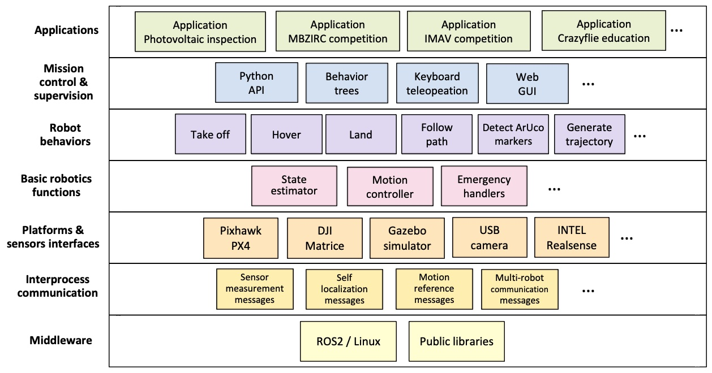

.. _as2_concepts_architecture:

============
Architecture
============

   
   Aerostack2 architecture

.. _as2_concepts_architecture_inter_process_communication:

---------------------------
Inter-process Communication
---------------------------

It includes components to facilitate communication between processes operating concurrently. 
These are message types for information exchange that define data structures (specific to aerial robotics) that are common to facilitate process interoperability.

.. _as2_concepts_architecture_platform:

--------------------
Platform and Sensors
--------------------

These are components that serve as interfaces with aerial platforms and sensors. 
Aerostack has several interfaces that allow operating with both physical platforms (e.g., with Pixhawk or with DJI platforms) and simulated platforms (e.g., using simulated drones with the Gazebo environment) besides different kinds of sensors (e.g., USB cameras, RealSense depth camera).

.. _as2_concepts_architecture_robotics_functions:

------------------
Robotics Functions
------------------

Aerostack2 includes a set of software components that implement specialized algorithms corresponding to essential aerial robotics functions for autonomous operation such as state estimation, motion control and other basic functions (e.g., emergency handling, etc.). 

.. _as2_concepts_architecture_behaviors:

---------
Behaviors
---------

This level includes a set of components corresponding to different robot behaviors provided by Aerostack for autonomous operation. 
Each component encapsulates the algorithms used to implement a particular behavior (e.g., take off, hover, generate trajectory, etc.) together with mechanisms for execution monitoring to facilitate the specification of mission plans. 
Each behavior has a uniform interface that is common for all behaviors to facilitate its use.

.. _as2_concepts_architecture_mission_controll:

---------------
Mission Control
---------------

This level includes components that facilitate the specification of missions for autonomous drone operation. 
For example, behavior trees can be used to indicate and visualize with a hierarchical graphical structure the tasks performed by the drone. 
On the other hand, Aerostack also provides an API (application programming interface) that allows to specify missions in a flexible way using the Python language. 
This API makes use of another component to abstract relevant information in form of symbolic representation of beliefs. In addition, Aerostack provides tools to the user to monitor and control manually the mission execution.

.. _as2_concepts_architecture_applications:

------------
Applications
------------

The top level corresponds to the specific applications built with the components of the lower levels. 
Aerostack has examples of applications that can serve developers as a reference and guide on how to build drones that operate autonomously. 
In addition to applications with real drones, Aerostack has multiple applications on simulated environments with varying degrees of complexity to facilitate learning this technology.

.. Aerostack provides a software library to implement robot behaviors that can be used by developers to build a particular robotic system architecture. 
.. Examples of these components are:

.. * Feature extractors that read simple states of sensors or implement vision recognition algorithms,

.. * Motion controllers (e.g., PID controllers or MPC controllers),

.. * Behaviors that perform self-localization and mapping (SLAM),

.. * Motion planners that generate obstacle-free paths to reach destination points, and

.. * Methods for communicating with other agents (other robots or human operators).

.. The library is open, so new behaviors can be included easily in the future, without changing the core of the system and the rest of the behaviors.

.. Each behavior in Aerostack is characterized by the following properties:

.. * Common communication. Each behavior sends and/or receive messages using the common communication channel used by the Aerostack2 architecture. 
..   If several behaviors publish data in the same ROS topic (e.g., different motion controllers), additional mechanisms must be used to avoid conflicts.

.. * Uniform interface. Each behavior has a uniform interface to control its execution (e.g., activate and deactivate). 
..   Each behavior provides cognizant failure, i.e., it verifies the correct execution with a reflective process that verifies whether 
..   the task is done correctly or not to inform about success or failure.