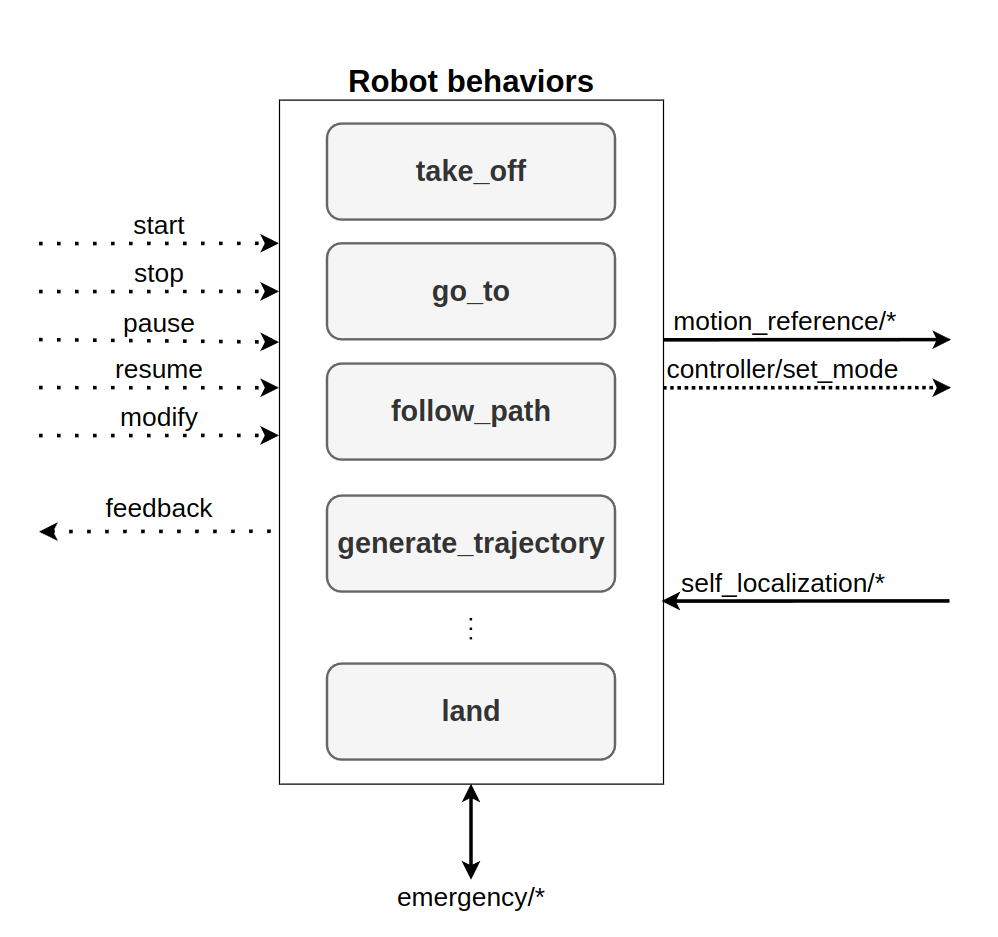

.. _as2_concepts_behaviors:

=========
Behaviors
=========

Aerostack2 uses a specialized type of component, called behavior, that implements functional robotic abilities such as motion control, motion planning, or perception processing.
Behaviors provide a logical layer to formulate mission plans.
Using behaviors, a mission plan is expressed as a controlled sequence of activations (or deactivations) of multiple behaviors that may operate concurrently.
Each behavior activation initiates the execution of a particular task described with certain parameters (e.g., following a particular path described with a list of waypoints). 
Compared to directly use of state estimators and actuator controllers, behaviors provide a simple and uniform method to define missions.

Each behavior component encapsulates the implementation of the algorithms used to execute the task, providing a common interface for all behaviors.
Therefore, the behavior implementation encapsulates how a specific task is accomplished, e.g. a landing maneuver can be done by descending until touching the ground, or using vision for centering the drone in a landing spot.
In both cases, the system calls the landing behavior using an identical interface regardless of the implementation details are.

This common interface is used to control the execution of the behavior. 
Aerostack2 behaviors extend ROS2 actions with some ROS2 services. 
The main difference is the ability to pause, resume and modify the running goal, while standard ROS2 actions can only be activated and cancelled.
The interface also informs about the execution of the behavior with two separate outputs: the execution state of the behavior (e.g., idle, running, or paused), and a periodic feedback.
The feedback provides information about the progress of the behavior execution, e.g., the current position of the drone while following a path.

   
   Aerostack2 behaviors interface.

.. warning:: Do not mix up aerostack2 behaviors with behavior trees. Behaviors can be used with and without behavior trees. The BT is the "task planner" while the behavior system is the "executor". You can replace BT with other planners available in Aerostack2. ``as2_behavior_trees`` package contains BT NodeTrees wrappers to activate Aerostack2 behaviors. are used to specify the mission plan, while the behaviors are the components that implement the tasks of the mission plan.

The catalog of behaviors can be checked in the following section :ref:`behaviors`.

Finally, how to add your custom new behavior can be found in the :ref:`development_tutorials_behavior` section.