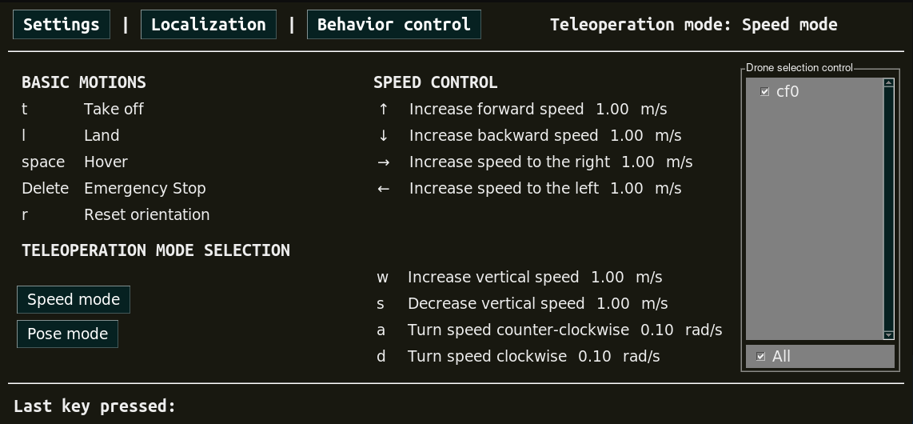
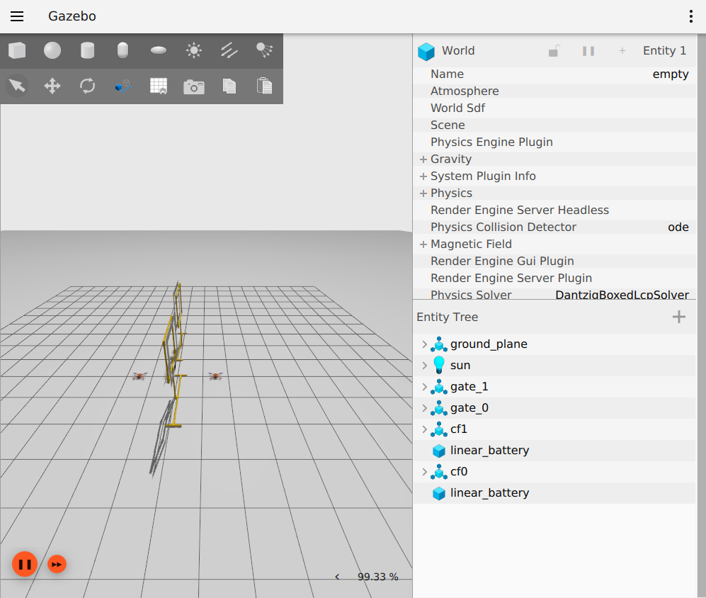

.. _project_crazyflie_gates:

========================
Crazyflie Gates Example
========================

This project contains the simulated version, which uses :ref:`Gazebo Platform <aerial_platform_ignition_gazebo>`, and 
the real version, which uses :ref:`Crazyflie Platform <aerial_platform_crazyflie>`. You can install them following the instructions in :ref:`Gazebo Platform installation section <aerial_platform_ignition_gazebo_installation>` and :ref:`Crazyflie Platform installation section <aerial_platform_crazyflie_installation>`.

To install this project, please clone the repository:

.. code-block:: bash

   git clone https://github.com/aerostack2/project_crazyflie_gates

To start using this project, please go to the root folder of the project.

.. _project_crazyflie_gates_simulated:

---------
Execution
---------

The flags for the components launcher are:

- ``-s``: launch the components for the simulated version.
- ``-m``: launch the components for the swarm multiagent system.
- ``-t``: launch keyboard teleoperation.
- ``-r``: record rosbag.
- ``-n``: use custom dron namespace.

Arguments for the components launcher are:

- ``-e``: estimator type. Allowed values [``ground_truth``, ``raw_odometry``, ``mocap``]. Default: ``ground_truth``.

-------------------
Simulated execution
-------------------

We can execute this project in simulation mode. This will open a simulation in Gazebo and the Aerostack2 components will use simulation time.

.. _project_crazyflie_gates_simulated_single_drone:

Single drone
============

In order to launch the components for a **single drone**, do:

.. code-block:: bash

    ./launch_as2.bash -s -t

This will open a simulation for a single drone alongside the Aerostack2 components necessary for the mission execution.

A window like the following image should open.

.. figure:: images/single_drone_sim.png
   :scale: 50
   :class: with-shadow
   
   Ignition Gazebo simulator

It will also open a keyboard teleoperation (argument ``-t``), which you can use to teleoperate the drone with the :ref:`aerostack2 keyboard teleoperation user interface <user_interfaces_keyboard_teleoperation>`.

A window like the following image should popup:

   
   Keyboard teleoperation

To start the mission, go to a new terminal line and execute:

.. code-block:: bash

    python3 mission.py -s

Here is an example of the simulated execution of the mission with a single drone:

.. raw:: html

    

        <iframe src="https://www.youtube.com/embed/vWzN8nDdEmk" frameborder="0" allowfullscreen style="position: absolute; top: 0; left: 0; width: 100%; height: 100%;"></iframe>
    

To do a clean exit of tmux, execute:

.. code-block:: bash

    ./stop.bash cf0

.. _project_crazyflie_simulated_swarm_drones:

Swarm drones
============

In order to launch the components for a **swarm of 2 drones**, do:

.. code-block:: bash

    ./launch_as2.bash -s -m -t

This will open a simulation for a swarm (argument ``-m``) of 3 drones alongside the Aerostack2 components necessary for the mission execution.

A window like the following image should open.

   
   Ignition Gazebo simulator

It will also open a keyboard teleoperation (argument ``-t``), which you can use to teleoperate the swarm with the :ref:`aerostack2 keyboard teleoperation user interface <user_interfaces_keyboard_teleoperation>`.

A window like the following image should popup:

.. figure:: images/keyboard_swarm_view.png
   :scale: 50
   :class: with-shadow
   
   Keyboard teleoperation

To start the mission, execute:

.. code-block:: bash

    python3 mission_swarm.py -s

Here is an example of the simulated execution of the mission with a swarm of drones:

.. raw:: html

    

        <iframe src="https://www.youtube.com/embed/HnUT1PMr8b4" frameborder="0" allowfullscreen style="position: absolute; top: 0; left: 0; width: 100%; height: 100%;"></iframe>
    

To do a clean exit of tmux, execute the following command with the list of the used drones:

.. code-block:: bash

    ./stop.bash cf0 cf1

.. _project_crazyflie_real:

--------------
Real execution
--------------

In order to perform a real execution of this project, it is needed to have the crazyflie(s) :ref:`configured <aerial_platform_crazyflie_installation_prerequisites>` and switched on in its initial position. 

Before launching the components, remember to set the correct address in the file ``real_config/swarm_config_file.yaml``, as indicated in :ref:`aerial_platform_crazyflie_platform_launch`.
Leave only the entries for the drone(s) that will be used, even if it is only one.

It is also important to decide which state estimator to use. Currently, Aerostack2 supports two types of state estimators for the Crazyflie, this are:

- **Optitrack**: which uses ``mocap`` plugin. 
- **Optical Flow**: which uses ``raw_odometry`` plugin.

.. note::

    Before launching the components with **mocap**, it is also necessary to set the file ``real_config/mocap.yaml``. This file will be used by the state estimator mocap plugin to 
    get the ground truth pose coming from our motion capture system into the Aerostack2 common interface localization :ref:`topics <ros2_common_interfaces_state_estimator_topics>`.

.. warning:: 

    In order to use motion capture system localization, please clone the intermediate component inside Aerostack2 workspace with:

    .. code-block:: bash

        git clone https://github.com/aerostack2/mocap_optitrack

    and build it alongside the other Aerostack2 components.

.. _project_crazyflie_gates_real_single_drone:

Single drone
============

In order to launch the components for a **single drone** with **optical flow**, do:

.. code-block:: bash

    ./launch_as2.bash -e raw_odometry -t

Before launching the components with **mocap**, it is also necessary to set the file ``real_config/mocap.yaml``. This file will be used by the state estimator mocap plugin to 
get the ground truth pose coming from our motion capture system into the Aerostack2 common interface localization :ref:`topics <ros2_common_interfaces_state_estimator_topics>`.

In order to launch the components for a **single drone** with **mocap**, do:

.. code-block:: bash

    ./launch_as2.bash -e mocap -t

To start the mission for a **single drone**, go to a new terminal line and execute:

.. code-block:: bash

    python3 mission.py

Here is an example of the real execution of the mission with a single drone:

.. raw:: html

    

        <iframe src="https://www.youtube.com/embed/4XE4n07AtD4" frameborder="0" allowfullscreen style="position: absolute; top: 0; left: 0; width: 100%; height: 100%;"></iframe>
    

To do a clean exit of tmux, execute the following command:

.. code-block:: bash

    ./stop.bash cf0

.. _project_crazyflie_real_swarm_drones:

Swarm drones
============

In order to launch the components for a **swarm of 2 drones** with **optical flow**, do:

.. code-block:: bash

    ./launch_as2.bash -m -e raw_odometry -t

In order to launch the components for a **swarm of 2 drones** with **mocap**, do:

.. code-block:: bash

    ./launch_as2.bash -m -e mocap -t

To start the mission for a **swarm of 2 drones**, go to a new terminal line and execute:

.. code-block:: bash

    python3 mission_swarm.py

Here is an example of the execution of the real mission with a swarm of drones:

.. raw:: html

    

        <iframe src="https://www.youtube.com/embed/WLpjKAOyUC4" frameborder="0" allowfullscreen style="position: absolute; top: 0; left: 0; width: 100%; height: 100%;"></iframe>
    

To do a clean exit of tmux, execute the following command with the list of the used drones:

.. code-block:: bash

    ./stop.bash cf0 cf1