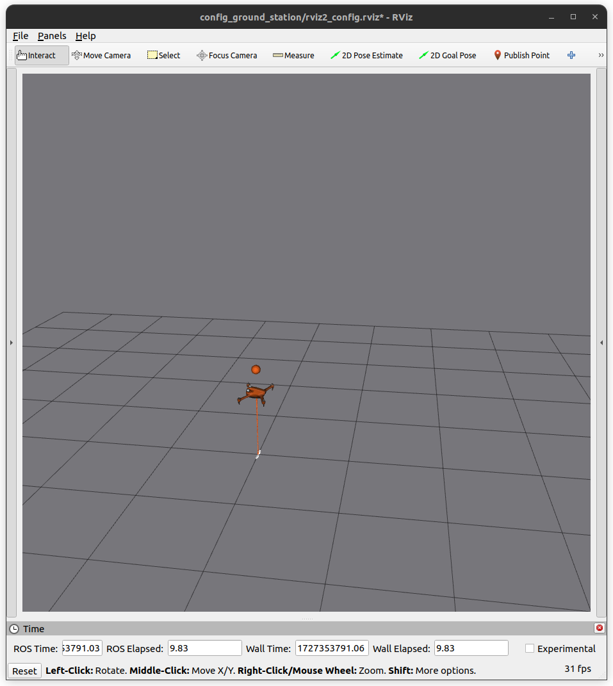
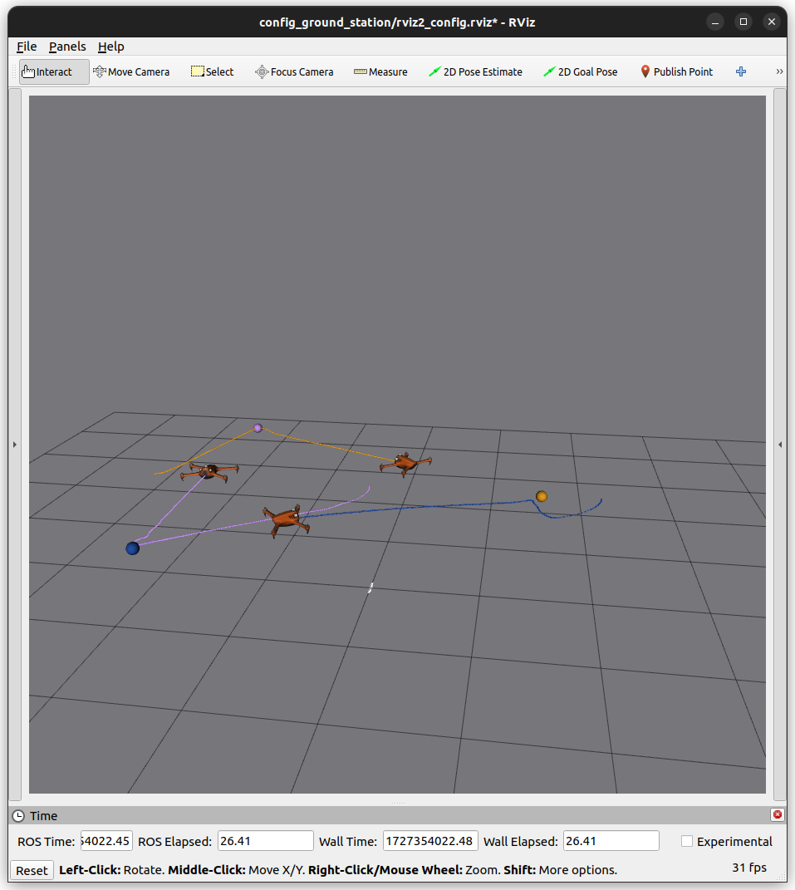

.. _project_ms:

===================================
Simple Multirotor Simulator Example
===================================

To install this project, clone the repository:

.. code-block:: bash

   git clone https://github.com/aerostack2/project_as2_multirotor_simulator.git

To start using this project, please go to the root folder of the project.

.. _project_ms_launching:

---------
Launching
---------

The execution on the project is split into two parts: Aerostack2 components and ground station.

Launching Aerostack2
====================

To launch the Aerostack2 components, execute the following command:

.. code-block:: bash

    ./launch_as2.bash

Launcher offers a few options to customize the execution. ``./launch_as2.bash -h`` will show option list. Options can be set with the following flags:

- ``-c``: motion controller plugin (pid_speed_controller, differential_flatness_controller), choices: [pid, df]. Default: pid
- ``-m``: multi agent. Default not set
- ``-n``: select drones namespace to launch, values are comma separated. By default, it will get all drones from world description file
- ``-g``: launch using gnome-terminal instead of tmux. Default not set

Launching Ground Station
========================

To launch the ground station, execute the following command:

.. code-block:: bash

    ./launch_ground_station.bash

Launcher offers a different pool of options to customize the execution. ``./launch_ground_station.bash -h`` will show option list. Options can be set with the following flags:

- ``-m``: multi agent. Default not set
- ``-t``: launch keyboard teleoperation. Default not launch
- ``-v``: open rviz. Default launch
- ``-r``: record rosbag. Default not launch
- ``-n``: drone namespaces, comma separated. Default get from world description config file
- ``-g``: launch using gnome-terminal instead of tmux. Default not set

Closing
=======

Close all nodes (aerostack2 and ground_station) with the following command executing outside the tmux session:

.. code-block:: bash

    ./stop.bash

.. note::

    The command ``tmux kill-server`` will have a similar effect but closing all tmux sessions, so be careful if you have other tmux sessions running.

    If launcher was executed with the flag ``-g``, closing should be done manually exiting all gnome-terminal tabs.

.. _project_ms_mission:

-----------------
Mission execution
-----------------

The project offers a few examples of mission execution.

- **Keyboard Teleoperation control**: Using reactive teleoperation control. For both single and multiagent swarms.
- **Python API missions**: Using Aerostack2 python API for mission definition. For single drone, using GPS and multiple drones.
- **Behavior Tree missions**: Using Behavior Tree as the mission planner. For single drone only.
- **Mission Interpreter**: Using Aerostack2 mission interpreter. For single drone only.

.. _project_ms_keyboard_teleoperation:

Keyboard Teleoperation control
==============================

In order to launch the components for a **single drone**, Aerostack2 launcher does not need any additional flags. Just execute ``./launch_as2.bash``.
This will launch the Aerostack2 components necessary for the mission execution. 

   
   Multirotor Simulator simulator

Ground station should be launched with ``-t`` flag to enable keyboard teleoperation. Take a look at the :ref:`keyboard teleoperation user guide <user_interfaces_keyboard_teleoperation>` for more information.
A window containing the teleoperation widget should pop up:

.. figure:: images/keyboard_teleop_view.png
   :scale: 50
   :class: with-shadow
   
   Keyboard teleoperation

.. note::

    The teleoperation widget is also available for multi drone missions. To launch a multi drone simulation, use the flag ``-m`` in both launch commands.

.. _project_ms_python_api:

Python API missions
===================

In order to launch the components for **multiple drones**, both launchers require the flag ``-m``.
This will launch the Aerostack2 components necessary for the mission execution.

   
   Multirotor Simulator simulator

There are three python scripts available for mission execution in the project. For single drone missions, use ``python3 mission.py`` for flying a square.
When flying using GPS, use ``python3 mission_gps.py`` which will fly a square using GPS waypoints.

For multi drone missions, use ``python3 mission_swarm.py`` where a group of drones will fly a swarm coreography.

.. note::

    To understand how missions are built using the Aerostack2 python API, take a look at the :ref:`development_guide_api_python_api` reference guide.

.. _project_ms_mission_interpreter:

Mission Interpreter
===================

Previous missions were defined using python syntaxis. Aerostask2 offers a mission interpreter that allows mission definition using a JSON format.
Currently, the mission interpreter script at the project is only available for single drone missions.
To launch the mission interpreter, execute ``python3 mission_interpreter.py``.
The execution is similar to the python API mission where the drone will fly a square.

.. _project_ms_behavior_tree:

Behavior Tree
=============

Missions can also be defined using a behavior tree. The project offers a mission example using a behavior tree for a single drone.
To launch the behavior tree mission, execute ``python3 mission_behavior_tree.py``.
The execution is similar to the python API mission where the drone will fly a square.

.. note::

    Trees can be defined using GUIs like `Groot <https://www.behaviortree.dev/groot/>`_.