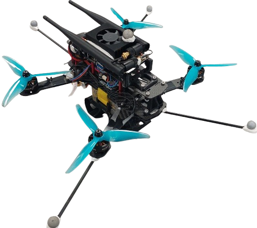

.. _aerial_platform_betaflight:

==================
Betaflight
==================

.. contents:: Table of Contents
   :depth: 3
   :local:

------------
Introduction
------------

All information about the Betaflight FCU and firmware can be found `here <https://betaflight.com/docs/wiki>`_.

.. _aerial_platform_px4_installation:

------------
Installation
------------

There is a :ref:`Betaflight Installation and Setup Guide <aerial_platform_betaflight_setup>` with the specific configuration used to fly drones with Aerostack2 for this controller, but feel free to explore the
`Betaflight official Setup guides <https://betaflight.com/docs/wiki/getting-started/setup-guide>`_.

.. _aerial_platform_betaflight_as2_common_interface:

---------------------------
Aerostack2 Common Interface
---------------------------

For more details about platform control modes and sensors, see :ref:`Aerostack2 Aerial Platform Concepts <as2_concepts_aerial_platform>`.

.. _aerial_platform_px4_as2_common_interface_control_modes:

Control Modes
=============

These are supported control modes:

.. list-table:: Control Modes Betaflight Platform
   :widths: 50 50 50
   :header-rows: 1

   * - Control Mode
     - Yaw Mode
     - Reference Frame
   * - Hover
     - None
     - None
   * - Acro
     - None
     - None

.. _aerial_platform_betaflight_as2_common_interface_sensors:

Sensors
=======

These are supported sensors:
  
.. list-table:: Sensors Pixhawk Platform
   :widths: 50 50 50
   :header-rows: 1

   * - Sensor
     - Topic
     - Type
   * - Odometry
     - sensor_measurements/odom
     - nav_msgs/Odometry
   * - IMU
     - sensor_measurements/imu
     - sensor_msgs/Imu
   * - Battery
     - sensor_measurements/battery
     - sensor_msgs/BatteryState