.. _aerial_platform_betaflight_setup:

==================
Betaflight Setup
==================

.. contents:: Table of Contents
   :depth: 3
   :local:

-----------------------------------
0. Connect to Betaflight controller
-----------------------------------

The Aerostack2 Betaflight platform has only been tested using Betaflight 4.4.0 version of the firmware, so first make sure this is the version you are working with. To do so, connect to the controller via USB to your PC.
Go to https://app.betaflight.com/ (requires a chromium based browser like Chrome or Edge) and click on the ‘Select your device’ dropdown menu.  

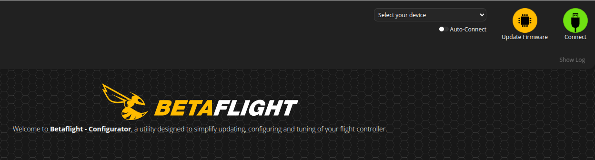

If it is the first time you are connecting to the controller, you will not see it on the menu so click on  ‘-- I can’t find my USB device --’. A window will pop up with the different devices detected, presumably only the one you want to connect to. Select it and then click ‘Connect’ on the top right corner 

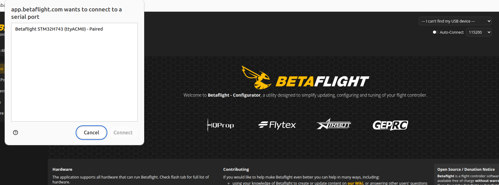

On the top left corner, you can check what Betaflight version your controller has. In this case, it’s 4.5.1 BTFL. 

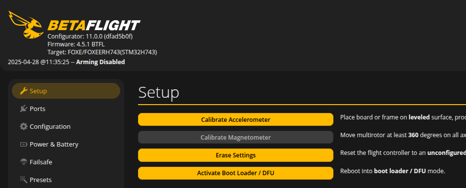

0.1 Flash New Firmware
======================

To flash a different version of the firmware, click on ‘Update Firmware’ at the top right corner. Focus on the top left part of the Firmware Flasher menu. Use the ‘Detect’ option next to the ‘Choose a board’ menu to automatically pick your board, and look for the specific version you want to install (in our case it’s 4.4.0). 

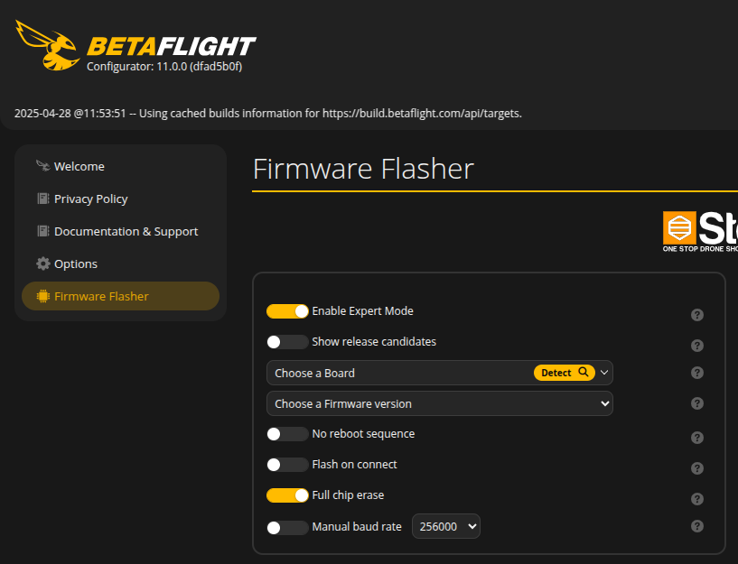
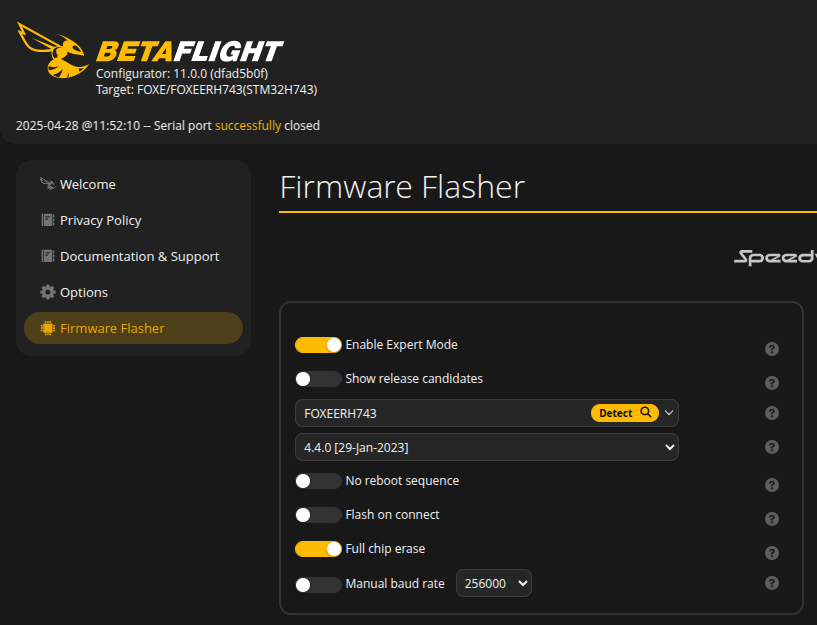

In the downside menu, select ‘GHOST’ as the ‘Radio Protocol’ and don’t change the default ‘Telemetry Protocol’. Select ‘Digital’ as the ‘OSD Protocol’ and check that the ‘Motor Protocol’ is set to ‘DSHOT’. Don’t forget to add the ‘ESC Serial (SK) inc. 4way’ option to the ‘Other Options’ menu. To add it, click on the menu bar next to the rest of options to open the dropdown. In the end, your Build Configuration should look like this 

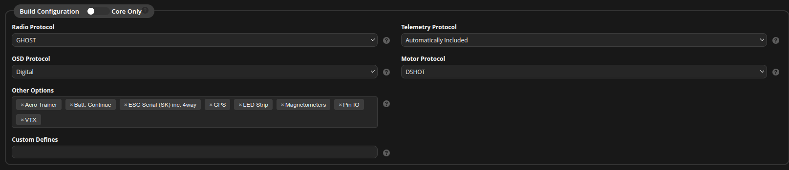

You can now click on ‘Load Firmware [Online]’ to set up the firmware, and click on ‘Flash Firmware’ once it is ready 

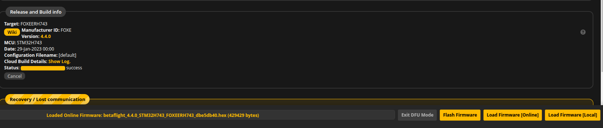

To check that the new version has been correctly flashed, reload the page and connect to the controller to see that the version is ‘4.4.0 BTFL’ now. The first time you reconnect, a pop up will appear. Select the option ‘Apply custom defaults’ to close the window. 

------------------
1. Configure Ports
------------------

.. warning:: FROM NOW ON AND UP UNTIL STEP 8, AFTER EACH STEP, REMEMBER TO CLICK ON SAVE AT THE BOTTOM RIGHT OF EACH SCREEN BEFORE MOVING TO A NEW SCREEN.

On the ‘Ports’ menu, the following ports must be enabled: 

- UART 2: enable the ‘Serial Rx’ check 
- UART 3: enable the ‘Configuration/MSP’ check so that NX can connect to the controller 
- For competition purposes, UART 7 needs the ‘Configuration/MSP’ check enabled and the ‘Peripherals’ dropdown set to ‘VTX (MSP + Displayport)’. If the drone is not going to be using VTX, this port can be left disabled. 
- UART 1: disable the 'Configuration/MSP' check

.. note:: You may notice there is a big warning message telling you to NOT disable the first serial port unless you know what your are doing. Well, we DO know what we are doing so be not afraid and disable it. 

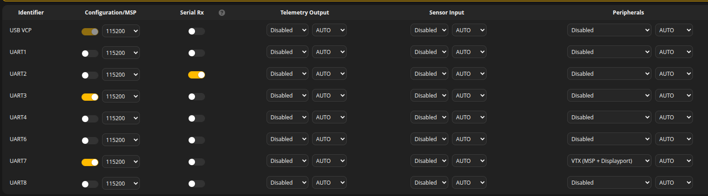

------------------------------
2. Check General Configuration
------------------------------

On the ‘Configuration’ screen, check the following options: 

- On the ‘System configuration’ menu, disable ‘Magnetometer’. This is not really important, but since the controller we are using does not have a magnetometer there is no point in leaving this enabled. 
- On the ‘Board Alignment’ menu, set ‘Yaw Degrees’ to 180 as the IMU is turned around when mounted on the drone. 
- On the ‘Other Features’ menu, disable ‘AIRMODE’ and enable ‘LED STRIP’, if you want to use the LED lights on the drone, and ‘OSD’. 

.. figure:: resources/8-1-btfl_general_configuration.png
   :scale: 50
   :class: with-shadow
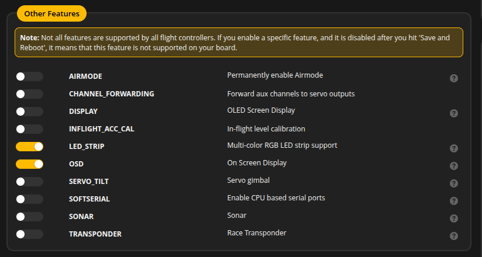

---------------
3. Set Failsafe
---------------

On the Failsafe Switch menu, set the ‘Failsafe Switch Action’ to ‘Kill’ so that the drone fully stop when ‘Failsafe’ is activated from the controller. 

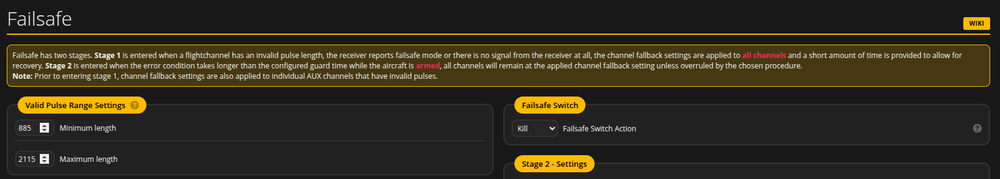

-----------------------
4. Set Controller Rates
-----------------------

On the ‘PID Tuning’ screen, select the ‘Rateprofile Settings’ menu and set the ‘RC Rate’ for each ROLL, PITCH and YAW to 1.80. Set every other fields to 0. The result should be three lineal curves ranging from –360 to 360 deg/s like the ones on the image 

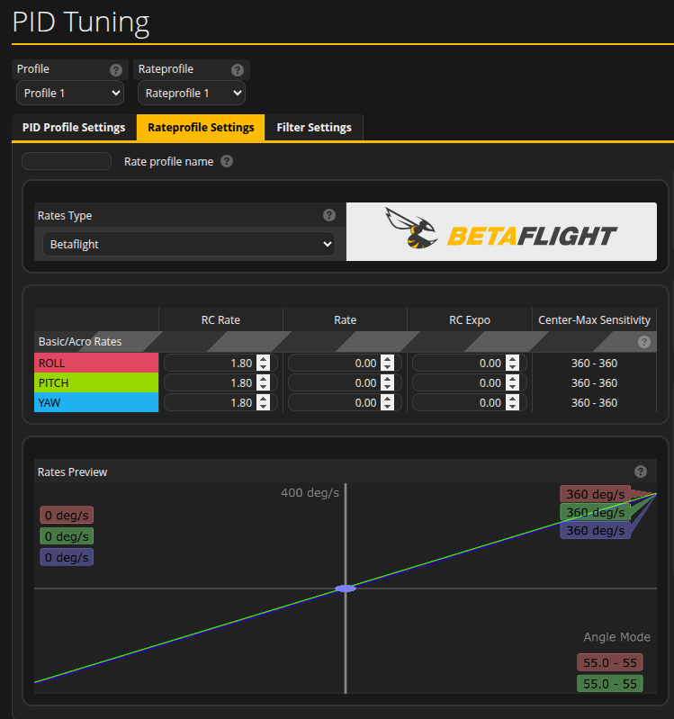

-------------------------------
5. Check Receiver Configuration
-------------------------------

On the ‘Receiver’ screen, set the ‘Receiver Mode’ to ‘Serial (via UART)’ and the ‘Serial Receiver Provider to ‘IRC GHOST’. 

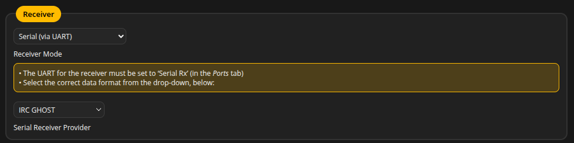

-----------------------
6. Set Controller Modes
-----------------------

On the ‘Modes’ screen, search for the following modes and set them to the next channels and values: 

- ARM: set the ‘ARM’ mode to channel ‘AUX 1’ and select a range that includes the 2000 value, for instance the 1700 – 2100 shown on the image. 
- ANGLE: this is the mode for ACRO flights using the RC controller. Set it to channel ‘AUX 2’ and select a range that includes value 1000, like the range 900-1600 shown on the image. By setting it this way, the RC controller has control of the drone as long as the ‘Offboard’ switch is not activated. 
- FAILSAFE: set this mode to channel ‘AUX 5’ and select a range that includes value 2000. This switch will kill the motors in case the drone loses control of itself. 

.. warning:: REMEMBER TO CLICK SAVE BEFORE LEAVING THIS SCREEN

There is one more mode to set but it is not visible yet. For this mode  to be set, click on the ‘CLI’ screen of the left side menu. On the command prompt of this screen, type the next command:

.. code-block::

    set msp_override_channels_mask=15

The value 15 is the decimal codification of the first for channels of the RC controller, this is, the ones used for Thrust, Roll, Pitch and Yaw. Once ‘Offboard’ switch is activated, MSP stops listening to the RC controller channels selected using this mask and listens to messages sent from the onboard computer. If this channels are not specified, all the channels would be overridden and it would be impossible for the pilot to recover control of the controller. 

Type the command

.. code-block::

    save

on the CLI command prompt and go back to the ‘Modes’ screen. You should be able to find a new mode: 

- MSP OVERRIDE: set this new mode to channel ‘AUX 2’, same as the ‘ANGLE’ mode, and select a range complementary to the ‘ANGLE’ one that includes value 2000, like shown on the image. 

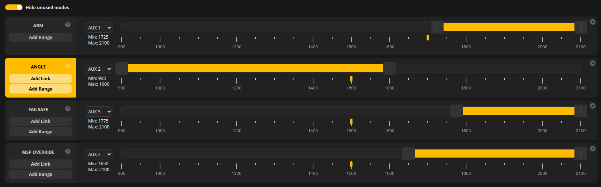

The channels specified for each mode correspond to the sticks and buttons shown in the following image

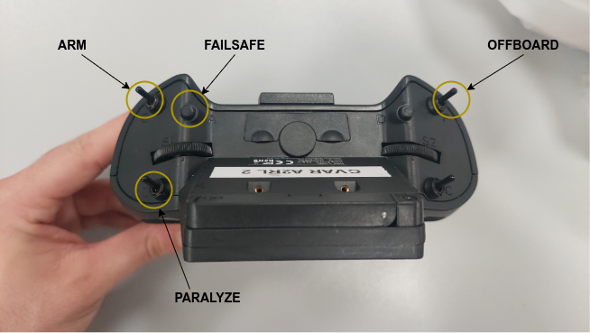

This is the configuration used by us, but you can change it to the one you feel the more comfortable with. Just make sure each mode is attached to the channel of the stick you want to use.

----------------------------
7. Check Motors Mixer Matrix
----------------------------

On the ‘Motors’ screen, verify that the ‘Mixer’ matrix (rotors configuration) is the same as the image: 

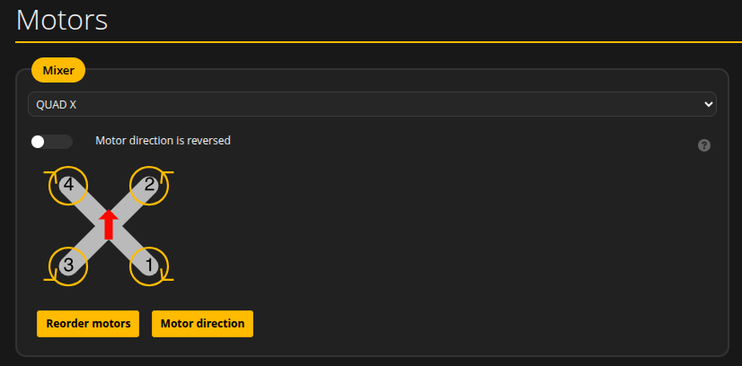

Additionally, a rotor test can be performed to double check the rotors configuration. 

.. warning:: Do NOT perform the rotor test with propellers mounted

Connect a battery and ‘understand the serious risks of injury’. This will enable the first for slide bars that control each rotor. One by one, move them to a value of approximately 1150 (never more than 1200) and check that the rotor is turning in the right direction. Once you are done testing, click on ‘Stop motors’. 

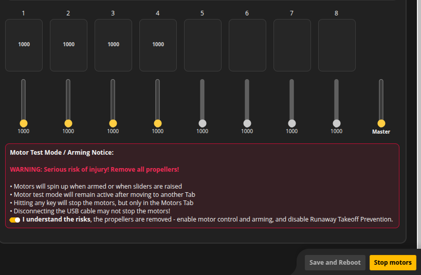

--------------------------
8. Additional CLI commands
--------------------------

There is a couple final steps to be followed on the ‘CLI’ screen. 

- To increase the IMU (and any other serial message publication) frequency, a parameter has to be set using the command 

.. code-block::

    set serial_update_rate_hz=500 

This parameter can be set to up to 2000, but 500 is enough for the IMU to publish at 200 Hz. The IMU publication rate can be set in the as2_platform_betaflight configuration file, but increasing the rate there without setting the serial_update_rate_hz will result in the IMU not being able to reach the desired publication rate. 

- After everything is set, the ‘Save to File’ option can be used to save all configuration parameters to a .txt file that can later be loaded from this same CLI screen to automatically configure the controller after the correct version has been flashed (steps 1-8 of this guide). In fact, a .txt file with the 4.4.0 BTFL with all the A2RL configuration already exists that can be loaded, but it is a better idea to follow the complete guide and learn to set the Betaflight controller 😊 

.. warning:: REMEMBER TO RUN THE COMMAND
    
    .. code-block::

        save 
    SO YOUR CHANGES ARE NOT LOST. 