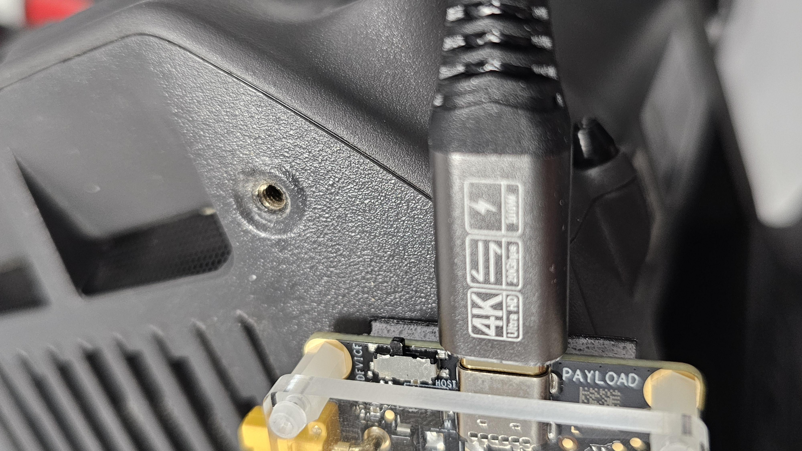
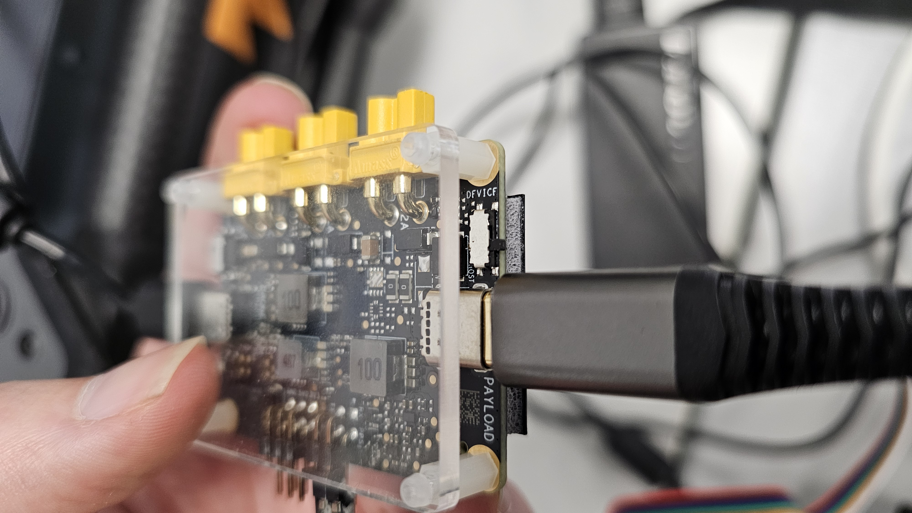
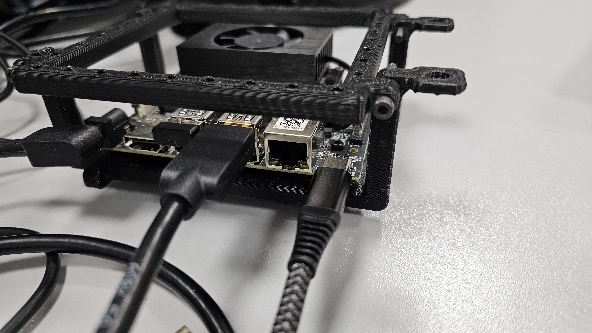

.. _aerial_platform_dji_matrice_psdk_psdk:

=======================
DJI Matrice Series PSDK
=======================

.. contents:: Table of Contents
   :depth: 3
   :local:

.. _aerial_platform_dji_matrice_psdk_introduction:

------------
Introduction
------------

The DJI Matrice Series using `DJI Onboard PSDK <https://github.com/dji-sdk/Onboard-SDK>`_
is compatible with **DJI M300, DJI M350, and DJI M30T**.

.. figure:: resources/DJI_M300.jpg
   :scale: 15
   :class: with-shadow
   :alt: DJI Matrice M300

.. _aerial_platform_dji_matrice_psdk_installation:

------------
Installation
------------

.. _aerial_platform_matrice_psdk_installation_prerequisites:

=============================================================
Prerequisites (One-Time Setup on Xavier/Orin NX/AGX Boards)
=============================================================

.. _aerial_platform_dji_matrice_psdk_installation_prerequisites_software_once:

1. Clone configuration repository
------------------------------

.. code-block:: console

   cd ~
   git clone git@github.com:aerostack2/psdk_config_files.git
   cd psdk_config_files

2. Disable ``l4t-device-mode`` auto start
--------------------------------------

.. code-block:: console

   sudo systemctl disable nv-l4t-usb-device-mode.service

3. Replace system device-mode script
---------------------------------

Copy your custom startup script into place and make it executable:

.. code-block:: console

   sudo cp ./nv-l4t-usb-device-mode-start.sh \
      /opt/nvidia/l4t-usb-device-mode/nv-l4t-usb-device-mode-start.sh
   chmod +x ./nv-l4t-usb-device-mode-start.sh

4. Customize the script
--------------------

Update the script to use the correct **USB-UDC port**:

- **For AGX:**

  .. code-block:: console

     sed -i 's/3550000\.xudc/3550000.usb/g' nv-l4t-usb-device-mode-start.sh

- **For NX:**

  .. code-block:: console

     sed -i 's/3550000\.usb/3550000.xudc/g' nv-l4t-usb-device-mode-start.sh

5. Grab bulk-mode program folder
-----------------------------

Download and unzip the reference package into ``~/Desktop/startup_bulk``:

.. code-block:: console

   wget https://terra-1-g.djicdn.com/71a7d383e71a4fb8887a310eb746b47f/psdk/e-port/usb-bulk-configuration-reference.zip \
     && unzip usb-bulk-configuration-reference.zip -d startup_bulk \
     && mv startup_bulk/ ~/Desktop/ \
     && chmod +x ~/Desktop/startup_bulk/*

6. Reboot
------

7. Load necessary kernel modules on boot
-------------------------------------

Append to ``/etc/modules`` (ensure correct formatting):

.. code-block:: console

   echo -e "configfs\nlibcomposite\nusb_f_fs\ntegra-xudc" | sudo tee -a /etc/modules

8. Test the setup
--------------

.. code-block:: console

   cd /opt/nvidia/l4t-usb-device-mode/
   ./nv-l4t-usb-device-mode-start.sh

9. Re-enable the service (if successful)
-------------------------------------

.. code-block:: console

   sudo systemctl enable /opt/nvidia/l4t-usb-device-mode/nv-l4t-usb-device-mode.service

Now both **bulk mode** and **network mode** are configured.

=================================================================
Prerequisites (Every Boot on Xavier/Orin NX/AGX Boards)
=================================================================

.. _aerial_platform_dji_matrice_psdk_installation_prerequisites_software_every_time:

M300
----

**Hardware**

- Onboard computer = **host**  
- E-Port = **device**  
- Use the Type-C port supporting both bulk and usbnet mode.

|m300_pic1| |m300_pic2|

.. |m300_pic2| image:: resources/agx_connections.jpg
   :width: 45%
   :alt: AGX USB connections (device)

**Software**

Enable host mode on the onboard computer:

.. code-block:: console

   echo host | sudo tee /sys/class/usb_role/usb2-0-role-switch/role

You should now see ``/dev/ttyACM0`` when powering on the drone.

M350
----

**Hardware**

- Onboard computer = **device**  
- E-Port = **host**  
- Use the Type-C port supporting both bulk and usbnet mode.

|m350_pic1| |m350_pic2|

.. |m350_pic2| image:: resources/agx_connections.jpg
   :width: 45%
   :alt: AGX USB connections (host)

**Software**

Enable device mode on the onboard computer:

.. code-block:: console

   echo device | sudo tee /sys/class/usb_role/usb2-0-role-switch/role

Bring up the ``l4tbr0`` interface:

.. code-block:: console

   sudo ifconfig usb0 192.168.1.1 netmask 255.255.255.0 up

Verify with:

.. code-block:: console

   ifconfig

You should see an entry for ``l4tbr0``.  
If not, repeat the above steps.

M30T
----

**Hardware**

- Onboard computer = **device**  
- E-Port = **host**  
- Use the Type-C port supporting both bulk and usbnet mode.

|m30t_pic1| |m30t_pic2|

**Software**

Enable device mode on the onboard computer:

.. code-block:: console

   echo device | sudo tee /sys/class/usb_role/usb2-0-role-switch/role

Bring up the ``l4tbr0`` interface:

.. code-block:: console

   sudo ifconfig usb0 192.168.1.1 netmask 255.255.255.0 up

Verify with:

.. code-block:: console

   ifconfig

You should see an entry for ``l4tbr0``.  
If not, repeat the above steps.

.. note::

   Both bulk and network mode remain enabled.
   The ``link_select`` parameter in the platform configuration should be
   ``use_uart_and_usb_bulk_device`` for M300 and
   ``use_uart_and_network_device`` for M350 and M30T.
   To connect to the drone, run the platform with the following JSON parameters:

   .. code-block:: json

      {
         "dji_sdk_link_config": {
            "link_available": "use_only_uart/use_uart_and_usb_bulk_device/use_uart_and_network_device",
            "link_select": "use_uart_and_network_device",
            "uart_config": {
               "uart1_device_name": "/dev/ttyUSB0",
               "uart2_device_enable": "true",
               "uart2_device_name": "/dev/ttyACM0"
            },
            "network_config": {
               "network_device_name": "l4tbr0",
               "network_usb_adapter_vid": "0x0B95",
               "network_usb_adapter_pid": "0x1790"
            },
            "usb_bulk_config": {
               "usb_device_vid": "0x0B95",
               "usb_device_pid": "0x1790",
               "usb_bulk1_device_name": "/dev/usb-ffs/bulk1",
               "usb_bulk1_interface_num": "2",
               "usb_bulk1_endpoint_in": "0x83",
               "usb_bulk1_endpoint_out": "0x02",
               "usb_bulk2_device_name": "/dev/usb-ffs/bulk2",
               "usb_bulk2_interface_num": "3",
               "usb_bulk2_endpoint_in": "0x84",
               "usb_bulk2_endpoint_out": "0x03"
            }
         }
      }

.. _aerial_platform_dji_matrice_psdk_installation_package:

=======================
Install Platform Package
=======================

Binary installation
-------------------

.. code-block:: bash

   sudo apt install ros-humble-as2-platform-dji-psdk

Source installation
-------------------

.. code-block:: bash

   # If Aerostack2 was installed from sources,
   # clone into the src folder of your workspace.
   cd ~/aerostack2_ws/src/aerostack2/as2_aerial_platforms
   git clone git@github.com:aerostack2/as2_platform_dji_psdk.git
   cd ~/aerostack2_ws
   rosdep install as2_platform_dji_psdk --from-paths src --ignore-src -r -y
   colcon build --packages-up-to as2_platform_dji_psdk

.. _aerial_platform_dji_matrice_psdk_as2_common_interface:

---------------------------
Aerostack2 Common Interface
---------------------------

For more details about platform control modes and sensors, see
:ref:`Aerostack2 Aerial Platform Concepts <as2_concepts_aerial_platform>`.

Control Modes
=============

Supported control modes:

.. list-table:: Control Modes DJI PSDK Platform
   :widths: 50 50 50
   :header-rows: 1

   * - Control Mode
     - Yaw Mode
     - Reference Frame
   * - Speed
     - Speed
     - ENU

Sensors
=======

Supported sensors:

.. list-table:: Sensors DJI PSDK Platform
   :widths: 50 50 50
   :header-rows: 1

   * - Sensor
     - Topic
     - Type
   * - Odometry
     - sensor_measurements/odom
     - nav_msgs/Odometry
   * - IMU
     - sensor_measurements/imu
     - sensor_msgs/Imu
   * - Battery
     - sensor_measurements/battery
     - sensor_msgs/BatteryState
   * - GPS
     - sensor_measurements/gps
     - sensor_msgs/NavSatFix
   * - Camera
     - sensor_measurements/camera
     - sensor_msgs/Image

.. _aerial_platform_dji_matrice_psdk_platform_launch:

---------------
Platform Launch
---------------

Aerostack2 provides a launch file for this platform:

.. code-block:: bash

  ros2 launch as2_platform_dji_psdk as2_platform_dji_psdk.launch.py

Additionally, the `ROS 2 PSDK Wrapper <https://github.com/umdlife/psdk_ros2>`_
must be launched before the platform:

.. code-block:: bash

  ros2 launch as2_platform_dji_psdk psdk_wrapper.launch.py

To view all **available parameters**, use the ``-s`` flag to show descriptions
in the launch file.
