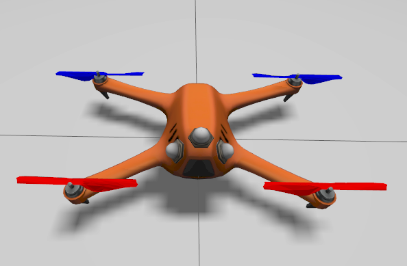

.. _aerial_platform_ignition_gazebo:

===============
Ignition Gazebo
===============

.. contents:: Table of Contents
   :depth: 3
   :local:

.. _aerial_platform_ignition_gazebo_introduction:

------------
Introduction
------------

For simulation purposes with `Ignition Gazebo simulator <https://gazebosim.org/api/gazebo>`__ , Aerostack2 provides with a platform that serves as an entry point for aerial robotics simulated in this environment.

.. _aerial_platform_ignition_gazebo_installation:

------------
Installation
------------

.. _aerial_platform_ignition_gazebo_installation_prerequisites:

Prerequisites
=============

Ignition Gazebo in Fortress version is required. For installation instructions, follow the `Ignition Gazebo Fortress installation guide <https://gazebosim.org/docs/fortress/install_ubuntu>`__.

.. _aerial_platform_ignition_gazebo_installation_package:

Install platform package
========================

* For binary installation, install by running:

.. code-block:: bash

   sudo apt install ros-humble-as2-platform-ign-gazebo

.. warning:: This package is not available for binary installation yet. Cooming soon.

* For source installation, clone Aerostack2 repository into your workspace and build it. See it in :ref:`Aerostack2 installation guide <getting_started_ubuntu_installation_source>`.

.. _aerial_platform_ignition_gazebo_installation_assets:

Install simulation assets
=========================

* For binary installation, install by running:

.. code-block:: bash

   sudo apt install ros-humble-as2-ign-gazebo-assets

.. warning:: This package is not available for binary installation yet. Cooming soon.

* For source installation, clone Aerostack2 repository into your workspace and build it. See it in :ref:`Aerostack2 installation guide <getting_started_ubuntu_installation_source>`.

.. _aerial_platform_ignition_gazebo_as2_common_interface:

---------------------------
Aerostack2 Common Interface
---------------------------

For more details about platform control modes and sensors, see :ref:`Aerostack2 Aerial Platform Concepts <as2_concepts_aerial_platform>`.
For more details, about bridge between Ignition Gazebo and ROS, see the :ref:`Aerostack2 Ignition Gazebo ROS Bridge <aerial_platform_ignition_gazebo_ros_gz_bridge>`.

.. _aerial_platform_ignition_gazebo_as2_common_interface_control_modes:

Control Modes
=============

These are supported control modes:

.. list-table:: Control Modes Ignition Gazebo Platform
   :widths: 50 50 50
   :header-rows: 1

   * - Control Mode
     - Yaw Mode
     - Reference Frame
   * - Hover
     - None
     - None
   * - Speed
     - Speed
     - FLU

.. _aerial_platform_ignition_gazebo_as2_common_interface_sensors:

Sensors
=======

These are supported sensors:
  
.. list-table:: Sensors Ignition Gazebo Platform
   :widths: 50 50 50
   :header-rows: 1

   * - Sensor
     - Topic
     - Type
   * - IMU
     - sensor_measurements/imu
     - sensor_msgs/msg/Imu
   * - Magnetometer
     - sensor_measurements/magnetic_field
     - sensor_msgs/msg/MagneticField
   * - Air pressure
     - sensor_measurements/air_pressure
     - sensor_msgs/msg/FluidPressure
   * - Battery
     - sensor_measurements/battery
     - sensor_msgs/msg/BatteryState
   * - Camera
     - sensor_measurements/{model_name}/image_raw
     - sensor_msgs/msg/Image
   * - Depth camera
     - sensor_measurements/{model_name}/depth
     - sensor_msgs/msg/Image
   * - Camera
     - sensor_measurements/{model_name}/camera_info
     - sensor_msgs/msg/CameraInfo
   * - Lidar
     - sensor_measurements/{model_name}/scan
     - sensor_msgs/msg/LaserScan
   * - Lidar
     - sensor_measurements/{model_name}/points
     - sensor_msgs/msg/PointCloud2
   * - Camera
     - sensor_measurements/{model_name}/points
     - sensor_msgs/msg/PointCloud2

.. _aerial_platform_ignition_gazebo_config_simulation:

-----------------
Config Simulation
-----------------

There are two aerial models available for simulation. These models are:

* Quadrotor base.
  

   
   Quadrotor base model

* Hexrotor base.

.. figure:: images/hexrotor.png
   :width: 400
   :scale: 50
   :class: with-shadow
   
   Hexrotor base model

In order to add an aerial model with sensors attached to it to the simulated world, Aerostack2 uses a configuration file, with JSON format, with the following structure:

.. code-block:: json

  {
    "world": "empty",
    "drones": [
        {
            "model": "quadrotor_base",
            "name": "drone_sim_0",
            "xyz": [ 1.0, 1.0, 0.3 ],
            "rpy": [ 0.0, 0.0, 0.0 ],
            "sensors": {
              "gps": {
                "sensor": "gps"
              }
            }
        }
    ]
  }

Where:

* ``world``: name of the defined world in sdf format.
* ``drones``: list of drones to be included in the world.
  
Each of the ``drones`` is defined by:

* ``model``: model of the drone defined in sdf format.
* ``name``: namespace
* ``xyz``: spawn position
* ``rpy``: spawn orientation 
* ``sensors``: list of sensors attached to the model

Each of the ``sensors`` is defined by:

* ``type``: name of the sensor inside de simulation (this case ``gps``)
* ``sensor``: name of the sensor defined in sdf format.

New models, sensors and worlds are defined in the ``as2_ignition_assets`` package. For more information on how to create new assets, go to the `Ignition Fortress tutorial page <https://gazebosim.org/docs/fortress/tutorials>`_.

.. _aerial_platform_ignition_gazebo_platform_launch:

---------------
Platform Launch
---------------

Aerostack2 Ignition Gazebo platform provides a launch file, which parameters are:

.. list-table:: Ignition Gazebo Platform Parameters
   :widths: 50 50 50
   :header-rows: 1

   * - Parameter
     - Type
     - Description
   * - namespace
     - string
     - Namespace of the platform, also named as drone id. 
   * - config_file
     - string
     - Path to the simulation configuration file.
   * - control_modes_file
     - string
     - Optional. File path with the control modes configuration. Default the one in the package.
   * - use_sim_time
     - bool
     - Optional. Syncronize simulation time with node time. Default false.
   * - enable_takeoff_platform
     - bool
     - Optional. Enable takeoff by platfom. Default false.
   * - enable_land_platform
     - bool
     - Optional. Enable land by platfom. Default false.

Example of launch command:

.. code-block:: bash

  ros2 launch as2_platform_ign_gazebo ign_gazebo_launch.py namespace:=drone_sim_0 config_file:=world_json_path

For launch the simulation, run the following command:

.. code-block:: bash

  ros2 launch as2_ign_gazebo_assets launch_simulation.py config_file:=world_json_path