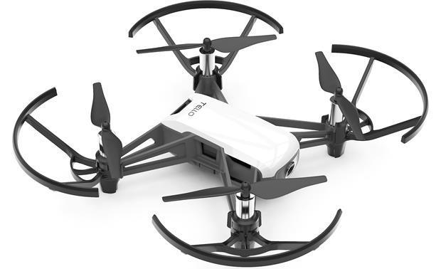

.. _aerial_platform_dji_tello:

==================
DJI Tello
==================

.. contents:: Table of Contents
   :depth: 3
   :local:

.. _aerial_platform_dji_tello_introduction:

------------
Introduction
------------

DJI Tello is controlled using UDP socket communication. The DJI Tello platform package provides a bridge between Aerostack2 and DJI Tello.

.. _aerial_platform_dji_tello_installation:

------------
Installation
------------

.. code-block:: bash

   sudo apt install ros-humble-as2-platform-tello

.. warning:: This package is not available for binary installation yet. Cooming soon.

* For source installation, clone the platform repository into your workspace and build it. 

.. code-block:: bash

    # If you have installed Aerostack2 from sources we recommend to clone the package in the src folder of your workspace otherwise you can clone it in any ROS 2 workspace you want.
    cd ~/aerostack2_ws/src/aerostack2/as2_aerial_platforms
    git clone git@github.com:aerostack2/as2_platform_tello.git
    cd ~/aerostack2_ws
    rosdep install as2_platform_tello --from-paths src --ignore-src -r -y
    colcon build --packages-up-to as2_platform_tello

.. _aerial_platform_dji_tello_installation_package:

Install platform package
========================

* For binary installation, install by running:

.. code-block:: bash

   sudo apt install ros-humble-as2-platform-tello

.. warning:: This package is not available for binary installation yet. Cooming soon.

* For source installation, clone Aerostack2 repository into your workspace and build it. See it in :ref:`Aerostack2 installation guide <getting_started_ubuntu_installation_source>`.

.. _aerial_platform_dji_tello_as2_common_interface:

---------------------------
Aerostack2 Common Interface
---------------------------

For more details about platform control modes and sensors, see :ref:`Aerostack2 Aerial Platform Concepts <as2_concepts_aerial_platform>`.

.. _aerial_platform_dji_tello_as2_common_interface_control_modes:

Control Modes
=============

These are supported control modes:

.. list-table:: Control Modes DJI Tello Platform
   :widths: 50 50 50
   :header-rows: 1

   * - Control Mode
     - Yaw Mode
     - Reference Frame
   * - Hover
     - None
     - None
   * - Speed
     - Speed
     - ENU

.. _aerial_platform_dji_tello_as2_common_interface_sensors:

Sensors
=======

These are supported sensors:
  
.. list-table:: Sensors DJI Tello Platform
   :widths: 50 50 50
   :header-rows: 1

   * - Sensor
     - Topic
     - Type
   * - Odometry
     - sensor_measurements/odom
     - nav_msgs/Odometry
   * - IMU
     - sensor_measurements/imu
     - sensor_msgs/Imu
   * - Battery
     - sensor_measurements/battery
     - sensor_msgs/BatteryState
   * - Barometer
     - sensor_measurements/barometer
     - sensor_msgs/FluidPressure
   * - Camera
     - sensor_measurements/camera
     - sensor_msgs/Image

.. _aerial_platform_dji_tello_platform_launch:

---------------
Platform Launch
---------------

Aerostack2 DJI Tello platform provides a launch file, which parameters are:

.. list-table:: DJI Tello Platform Parameters
   :widths: 50 50 50
   :header-rows: 1

   * - Parameter
     - Type
     - Description
   * - namespace
     - string
     - Namespace of the platform, also named as drone id.
   * - config
     - string
     - | Optional. File yaml path with the config file that set: 
       | command frequency in Hz (cmd_freq), info frequency in Hz (info_freq)  and
       | file path with the control modes configuration (control_modes_file). Default the file in the package.
   * - dji_app_config
     - string
     - | Text file with the DJI app configuration. Must have the following format: 
       | app_id: <your_app_id>
       | app_key: <your_app_key>
       | device: /dev/ttyUSB0
       | baudrate: 921600
       | acm_port: /dev/ttyACM0
   * - simulation_mode
     - bool
     - Optional, default false. Use for simulation with `DJI Assistant 2 <https://www.dji.com/es/downloads/softwares/assistant-dji-2-for-matrice>`_.

Example of launch command:

.. code-block:: bash

  ros2 launch as2_platform_dji_osdk as2_platform_dji_osdk_launch.py namespace:=drone1 dji_app_config:=UserConfig.txt

