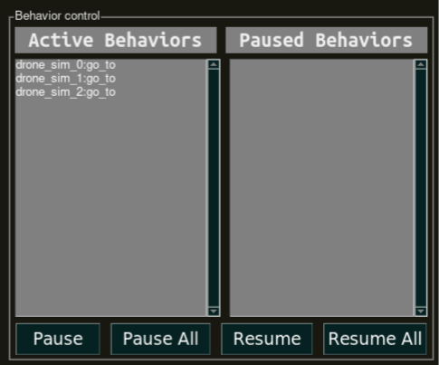
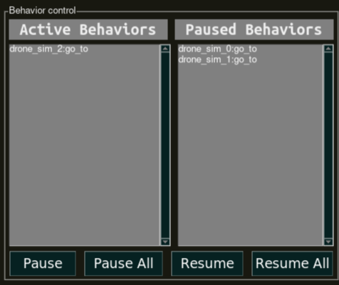

.. _user_interfaces_keyboard_teleoperation:

======================
Keyboard Teleoperation
======================

.. contents:: Table of Contents
   :depth: 3
   :local:

------------
Introduction
------------

Aerostack2's keyboard teleoperation interface serves as a multi-purpose control and visualization tool. It is able to send position and speed references to a swarm of drones, ability to select which of the drones is to be controlled, modify the values of the references sent, 
it has a simple localization window and there is also Aerostack2's behaviors management mechanisms.

.. _user_interfaces_keyboard_teleoperation_dependencies:

--------------------
Install dependencies
--------------------

To install PySimpleGUI package please execute the following command.

.. code-block:: bash
    
    pip install pysimplegui==4.60

----------------
Interface launch
----------------

Example of keyboard teleoperation tool launch command:

.. code-block:: bash

    ros2 launch as2_keyboard_teleoperation as2_keyboard_teleoperation_launch.py          namespace:=drone_sim_0,drone_sim_1,drone_sim_2         use_sim_time:=true

This will open keyboard teleoperation interface for drones with namespace: ``drone_sim_0``, ``drone_sim_1`` and ``drone_sim_2``.

------------
Instructions
------------

When the previous launch command is executed, a window like the following will open:

.. figure:: images/kb_instructions.png
   :scale: 100
   :class: with-shadow
   
   Keyboard teleoperation initial window.

Interface Components
####################

.. list-table::
   :widths: 50 50 50
   :header-rows: 1

   * - Number
     - Component type
     - Description
   * - 1
     - Settings button
     - This button will open :ref:`keyboard_teleoperation_settings_window`.
   * - 2
     - Localization button
     - This button will open :ref:`keyboard_teleoperation_localization_window`.
   * - 3
     - Behavior control button
     - This button will extend main interface with :ref:`keyboard_teleoperation_behavior_control` mechanisms.
   * - 4
     - Info Area
     - Selected control mode.
   * - 5
     - Info Area
     - Keyboard keys mapped to basic motions.
   * - 6
     - Info Area
     - Keyboard keys mapped to controller references with configured values for each motion type.
   * - 7
     - Speed mode button
     - This button will set keyboard teleoperation to speed control mode.
   * - 8
     - Pose mode button
     - This button will set keyboard teleoperation to pose control mode.
   * - 9
     - Info Area
     - Display of last key pressed.
   * - 10
     - Info Area
     - Drone selection control area.

.. _keyboard_teleoperation_settings_window:

Settings window
###############

Allows to change values for each motion control. To change a certain motion control type value, write the desired value into the 
box and click ``Save`` button. Changes will inmediately apply and change into the main window aswell.

.. figure:: images/kb_settings.png
   :scale: 100
   :class: with-shadow
   
   Keyboard teleoperation settings window.

.. _keyboard_teleoperation_localization_window:

Localization window
###################

Displays position and orientation for each active drone.

.. figure:: images/kb_localization.png
   :scale: 100
   :class: with-shadow
   
   Keyboard teleoperation localization window.

.. _keyboard_teleoperation_behavior_control:

Behavior control
################

This extension provides the user with mechanisms to pause and resume externally executed Aerostack2's behaviors regarding the 
active drones.  

   
   Keyboard teleoperation behavior control section.

In order to be able to pause behaviors, these behaviors must have been activated from other source (see: :ref:`python_api`). When these behaviors 
are activated, they will appear in the ``Active Behaviors`` section. Click on the desired behaviors and then press ``Pause`` button to pause them. When
pressing on ``Pause all``, all the active behaviors will be stopped simultaneously. 

.. figure:: images/kb_behavior_control_2.png
   :scale: 100
   :class: with-shadow
   
   Selecting two behaviors to be paused.

When having paused behaviors, these will appear in the ``Paused Behaviors`` section. 

   
   Keyboard teleoperation behavior control section after pausing two behaviors.