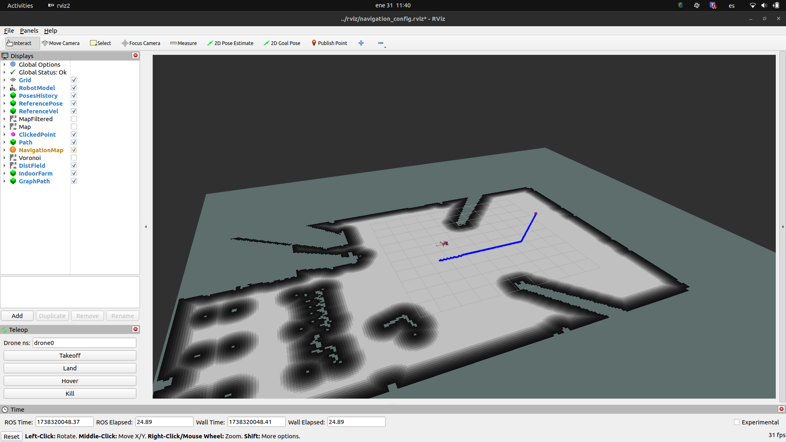
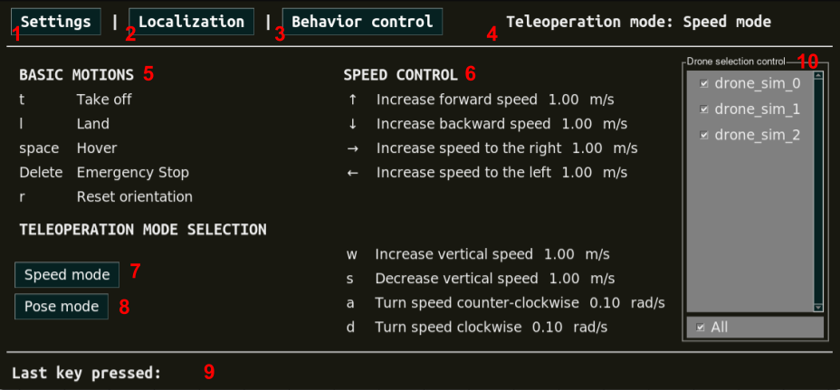

.. _gsoc:

.. _google_summer_of_code:

============================
Google Summer of Code (GSoC)
============================

.. `Google Summer of Code <https://summerofcode.withgoogle.com/>`__ is a global, online program focused on bringing new contributors into open source software development. GSoC Contributors work with an open source organization on a 12+ week programming project under the guidance of mentors.

`The Google Summer of Code (GSoC) <https://summerofcode.withgoogle.com/>`__, is an international annual program, first held from May to August 2005, in which Google awards stipends, which depends on the purchasing power parity of the country the student’s university belongs to, to all students who successfully complete a requested free and open-source software coding project during the summer. The program is open to university students aged 18 or over.

During Google Summer of Code, participating contributors are paired with mentors from open source organizations, gaining exposure to real-world software development techniques. Contributors will learn from experienced open source developers while writing code for real-world projects! A small stipend is provided as an incentive.

.. contents:: Table of Contents
   :depth: 3

===============
Why contribute?
===============

Aerostack2 is a ROS 2 based, open-source multipurpose framework designed to create autonomous multi-aerial-robot systems in an easy and powerful way.
The project has been under development since 2016, starting with the first version, Aerostack, which can be found here: `Aerostack Wiki <https://github.com/cvar-upm/aerostack/wiki>`_.
Since 2021, work has been focused on the development of Aerostack2.

The Aerostack2 environment is open source and free of charge, which facilitates universal access to this technology by autonomous drone developers.
It is offered with a BSD-3-Clause license that allows free distribution and modification of the software.

Our organization is a young and dynamic group, dedicated to pushing the boundaries of aerial robotics through collaboration and innovation.
We are focused on unifying the development of autonomous aerial robotics systems, aiming to establish Aerostack2 as a leading open-source framework that developers and researchers can rely on for their projects.

Nowadays, Aerostack2 has accumulated more than 2,000 commits and 500 pull requests, contributed by more than 20 international collaborators.

We have also actively engaged with the community to promote and improve Aerostack2, participating in working groups such as:

- `ROS-Aerial Robotics Working Group <https://github.com/ROS-Aerial/community>`_
- `Gazebo Community Meeting <https://community.gazebosim.org/tag/meeting>`_

Furthermore, Aerostack2 has been presented at international conferences:

- `ICRA 2023, London <https://www.icra2023.org/>`_
- `ROSCon 2023, New Orleans <https://roscon.ros.org/2023/>`_
- `ROSCon Spain 2023, Madrid <https://roscon.org.es/2023/ROSConMadrid2023.html>`_
- `RSS 2024, Deflt <https://roboticsconference.org/2024/>`_
- `ROSCon Spain 2024, Sevilla <https://roscon.org.es/ROSConES2024.html>`_
- `ROSCon Spain 2025, Barcelona <https://roscon.org.es/roscon-website-template/ROSConES2025.html>`_

.. raw:: html

  
<iframe src="https://player.vimeo.com/video/879000655?badge=0&amp;autopause=0&amp;player_id=0&amp;app_id=58479" frameborder="0" allow="autoplay; fullscreen; picture-in-picture; clipboard-write; encrypted-media" style="position:absolute;top:0;left:0;width:100%;height:100%;" title="Aerostack2: A framework for developing Multi-Robot Aerial Systems"></iframe>

.. raw:: html

  
<iframe width="100%" height="315" src="https://www.youtube.com/embed/LnTmqx08K3k?si=EmtJD34ET4KOUm78" title="YouTube video player" frameborder="0" allow="accelerometer; autoplay; clipboard-write; encrypted-media; gyroscope; picture-in-picture; web-share" referrerpolicy="strict-origin-when-cross-origin" allowfullscreen></iframe>

  

.. space after the video
.. here we can add a space after the video
.. to separate the video from the text

.. raw:: html

    

If you are interested in ROS 2, aerial robotics, and open-source software development, we invite you to join us in this exciting journey!

============================
Ideas List for GSoC 2026
============================

.. use small title
.. to create a new project, copy the below template and paste it below the last project
.. The template is as follows: 
.. - Title
.. - Brief Description
.. - Skills Required
.. - Difficulty Level
.. - Expected Outcome
.. - Expected size of the project
.. - Mentor

Below you will find the list of the different project ideas that we are proposing for Google Summer of Code 2026.

.. contents:: GSoC 2026
   :depth: 2
   :local:

.. _gsoc_project_1:

Project #1: New RViz2 RQT Plugins for Aerostack2
================================================

This project aims to enhance the visualization and interaction capabilities of the **Aerostack2**
framework by developing new **RViz2** and **RQT** plugins.
These plugins will provide **real-time monitoring**, **debugging**, and **control functionalities**
tailored to aerial robotics applications.

The project will focus on improving current **custom visualization plugins**
(`Aerostack2 Visualization <https://github.com/aerostack2/aerostack2/tree/main/as2_user_interfaces/as2_visualization/as2_visualization>`_)
to visualize drone states, trajectories, sensor data, and mission execution.
Moreover, it will create new RQT RViz tools
(`Aerostack2 RViz Plugins <https://github.com/aerostack2/aerostack2/tree/main/as2_user_interfaces/as2_visualization/as2_rviz_plugins>`_)
for intuitive interaction, such as sending commands, adjusting parameters, and monitoring system diagnostics.
Both tools will support drone swarms, not just single drones.

- **Skills Required/Preferred**
   RQT, ROS 2, Python (or C++)

- **Difficulty Level**
   Medium

- **Expected Outcome**
   To improve the usability and debugging experience for developers using Aerostack2. 

- **Expected Size of the Project**
   Medium (175h)

- **Mentors**
   Pedro Arias-Perez (pedro.arias.perez AT uvigo.gal),
   Guillermo GP-Lenza (guillermolenza AT gmail.com),
   Rodrigo Da Silva Gómez (rodrigods2001 AT gmail.com),
   Carmen DR.Pita-Romero (carmendrpr AT gmail.com)

.. _gsoc_project_2:

Project #2: RQT Keyboard Teleoperation & Alphanumeric View
==========================================================

This project aims to improve and extend the user interface capabilities of the **Aerostack2**
aerial robotics framework. To achieve this, we plan to replace and extend existing tools
such as the **Keyboard Teleoperation** and the **Alphanumeric Viewer**, integrating the new
tools as RQT plugins.

The already implemented `Keyboard Teleoperation <https://github.com/aerostack2/aerostack2/tree/main/as2_user_interfaces/as2_keyboard_teleoperation>`_ 
uses the PySimpleGUI library and functions as a simple ground station to control drones with
both position and speed commands.
It also allows pausing, resuming, and canceling Aerostack2 behaviors.
The goal is to completely remake this tool using RQT, discarding its PySimpleGUI counterpart.

The other tool is the `Alphanumeric Viewer <https://github.com/aerostack2/aerostack2/tree/main/as2_user_interfaces/as2_alphanumeric_viewer>`_.
This tool currently prints information in ASCII format in the console.
We do not intend to discard this tool, as it remains useful for its simplicity and the 
ability to view information via terminal when using SSH to connect to a remote onboard computer.
Instead, the new tool to be developed should serve as a more visually appealing and user-friendly
addition to monitor the drone's state.

.. figure:: resources/project_alphanumeric.png
   :scale: 40

- **Skills Required/Preferred**
   RQT, ROS 2, Python (or C++)

- **Difficulty Level**
   Medium

- **Expected Outcome**
   Replace the current user teleoperation interface with a RQT counterpart, together with adding a 
   new RQT alphanumeric viewer.

- **Expected Size of the Project**
   Medium (175h)

- **Mentors**
   Javier Melero Deza (javier.mdeza AT gmail.com),
   Rodrigo Da Silva Gómez (rodrigods2001 AT gmail.com)

.. _gsoc_project_3:

Project #3: Migration of current ROS 2 Nodes to Lifecycle Nodes in Aerostack2
=============================================================================

This project aims to migrate **Aerostack2** existing **ROS 2 nodes** to **lifecycle nodes**.
`Lifecycle nodes <https://github.com/ros2/demos/blob/humble/lifecycle/README.rst>`__
provide a structured way to manage the state of a node, allowing better control over
initialization, execution, and shutdown processes. 

The work will involve refac`oring the current nodes to adopt the managed lifecycle model, implementing
state transitions to optimize resource usage, and ensuring seamless integration with existing aerostack2
components.
Additionally, performance evaluations will be conducted to validate the benefits of this migration. 

.. raw:: html

  <iframe width="604" height="341" src="https://www.youtube.com/embed/_GXHBP5sA70" title="ROS2 - Lifecycle Node Tutorial" frameborder="0" allow="accelerometer; autoplay; clipboard-write; encrypted-media; gyroscope; picture-in-picture; web-share" referrerpolicy="strict-origin-when-cross-origin" allowfullscreen></iframe>

- **Skills Required/Preferred**
   ROS 2, C++, Python

- **Difficulty Level**
   Medium

- **Expected Outcome**
   One or two nodes migrated and working in Aerostack2 

- **Expected Size of the Project**
   Medium (175h)

- **Mentors**
   Pedro Arias-Perez (pedro.arias.perez AT uvigo.gal),
   Carmen DR.Pita-Romero (carmendrpr AT gmail.com),
   Francisco Anguita (fjac014 AT gmail.com),
   Guillermo GP-Lenza (guillermolenza AT gmail.com),

.. _gsoc_project_4:

Project #4: Tool for visualizing ROS Nodes output log
=====================================================

The main objective of this project is to develop a tool to improve the debugging of stdout and stderr
outputs on ROS 2 systems with multiple nodes that produce console outputs, especially though the
recording and postprocessing of the rosbag files. 

Console outputs are produced using the `ROS 2 logging utilities <https://docs.ros.org/en/jazzy/Tutorials/Demos/Logging-and-logger-configuration.html>`__,
and are ultimately published through the /rosout topic. When rosbags are reproduced, console logs for 
all the nodes in the system are displayed in the same topic, which makes debugging hard in systems with 
multiple ROS 2 nodes. The work will involve the development of a tool that eases this task by providing 
a clear visualization of the console outputs for the different ROS 2 nodes. 

- **Skills Required/Preferred**
   ROS 2, C++, Python, QT

- **Difficulty Level**
   Medium

- **Expected Outcome**
   RQT based tool for visualizing ROS 2 nodes output logs from topics or rosbags.

- **Expected Size of the Project**
   Medium (175h)

- **Mentors**
   Miguel Fernandez-Cortizas (miferco97 AT gmail.com),
   Guillermo GP-Lenza (guillermolenza AT gmail.com),
   Carmen DR.Pita-Romero (carmendrpr AT gmail.com)

.. _gsoc_project_5:

Project #5: System Integration Tests and Continuous Integration
===============================================================

This project focuses on the implementation of Integration Test to the CI pipeline.
An Aerostack2-based system is expected to run drone missions that produce expected outputs.
Integration tests allow to check the different Aerostack2 modules keep working together before
contributions are made. 

Aerostack2 uses `Github Workflows <https://docs.github.com/en/actions/writing-workflows>`__ to make sure
Aerostack2 builds and passes all tests when a Pull Request to the project is opened.
`ROS 2 launch_testing package <https://docs.ros.org/en/iron/p/launch_testing/>`__ can be used to add tasks
to the Continuous Integration workflow and verify the functionalities of an Aerostack2 system as a 
whole.

- **Skills Required/Preferred**
   ROS 2, C++, Python, Github Workflows, Testing libraries

- **Difficulty Level**
   Medium

- **Expected Outcome**
   Extension of the Aerostack2 CI pipeline to include system testing

- **Expected Size of the Project**
   Medium (175h)

- **Mentors**
   Rafael Perez-Segui (rafa.perez.s98 AT gmail.com),
   Francisco Anguita (fjac014 AT gmail.com)

.. _gsoc_project_6:

Project #6: Development of a Project Creation Tool for Aerostack2
=================================================================

This project aims to develop a tool that simplifies the creation and management of projects in Aerostack2.
In Aerostack2, a "project" consists of a structured set of configurations, launch files, and assets
designed to address a specific problem or application.
The tool will provide an intuitive interface to generate and organize these elements, reducing setup time
and improving usability for developers and researchers.
It will include functionalities for defining project parameters, selecting relevant modules, and
automatically generating necessary files developing new script utils like get_drones.py.
By streamlining the process of configuring Aerostack2 for different applications, this tool will enhance
productivity and make the framework more accessible to a broader range of users. 

.. raw:: html

  <iframe width="604" height="341" src="https://www.youtube.com/embed/HnUT1PMr8b4" title="Aerostack2 Project: Crazyflie Gates Simulated (Swarm)" frameborder="0" allow="accelerometer; autoplay; clipboard-write; encrypted-media; gyroscope; picture-in-picture; web-share" referrerpolicy="strict-origin-when-cross-origin" allowfullscreen></iframe>

- **Skills Required/Preferred**
   Python, QT, Tmux, Tmuxinator, Bash scripting

- **Difficulty Level**
   Medium

- **Expected Outcome**
   Project Creation Tool and script utils

- **Expected Size of the Project**
   Medium (175h)

- **Mentors**
   Javier Melero Deza (javier.mdeza AT gmail.com),
   Pedro Arias-Perez (pedro.arias.perez AT uvigo.gal),
   Carmen DR.Pita-Romero (carmendrpr AT gmail.com),
   Rodrigo Da Silva Gómez (rodrigods2001 AT gmail.com)

.. .. _gsoc_project_7:

.. Project #7: Migration to ROS 2 Jazzy and Gazebo Harmonic
.. ========================================================

.. This project aims to release an ROS 2 Jazzy compatible version of Aerostack2 framework. 

.. Jazzy is the latest Long-Term Support (LTS) distribution of the ROS 2 framework.
.. In this distribution, some fundamental issues have been resolved, making it convenient to migrate the
.. framework and make it available to the community. Furthermore, the primary simulator used in Aerostack2
.. is Gazebo, with the Harmonic version being the recommended choice for ROS 2 Jazzy.
.. Therefore, migrating the Gazebo-related components is also required. 

.. The work will involve resolving incompatibilities that arise from the version switch, validating the
.. correct functioning of the framework’s core functions, and adapting the Continuous Integration pipelines
.. and Docker containers. 

.. - **Skills Required/Preferred**
..    ROS 2, C++, Python, Gazebo, Github Workflows

.. - **Difficulty Level**
..    Easy

.. - **Expected Outcome**
..    ROS 2 Jazzy compatible Aerostack2 package released in ROS distro repositories

.. - **Expected Size of the Project**
..    Small (90h)

.. - **Mentors**
..    Miguel Fernandez-Cortizas (miferco97 AT gmail.com),
..    Rafael Perez-Segui (rafa.perez.s98 AT gmail.com),
..    Francisco Anguita (fjac014 AT gmail.com)

.. .. _gsoc_project_8:

.. Project #8: Behavior Client Implementation for C++
.. ==================================================

.. This project seeks to implement a Behavior Client that allows users to design missions using C++. 

.. Aerostack2 uses `behavior-based logic <https://aerostack2.github.io/_01_aerostack2_concepts/behaviors/index.html>`__
.. for mission definition and control. Currently, Aerostack2 has a 
.. `Python API <https://github.com/aerostack2/aerostack2/tree/main/as2_python_api>`__ with modules that
.. wrap around the different behaviors and implements functions that can be used in a Python script to make
.. calls to behaviors like a simple *go_to* or a *path_follower*.
.. A similar Behavior Client allows easier and faster mission definition using C++. 

.. .. figure:: resources/project_behaviors.png
..    :scale: 40
   
.. - **Skills Required/Preferred**
..    ROS 2, C++

.. - **Difficulty Level**
..    Medium

.. - **Expected Outcome**
..    C++ implementation of a Behavior Client for mission definition 

.. - **Expected Size of the Project**
..    Medium (175h)

.. - **Mentors**
..    Rafael Perez-Segui (rafa.perez.s98 AT gmail.com),
..    Francisco Anguita (fjac014 AT gmail.com),
..    Guillermo GP-Lenza (guillermolenza AT gmail.com)

========================================
Application instructions for GSoC 2026
========================================

We encourage you to apply for Google Summer of Code 2026 with any of the projects listed above. 
If you have any questions, please reach out to the mentor(s) listed for the project you are interested in or contact us at aerostack2 AT gmail.com.
We are looking for enthusiastic students who are passionated and willing to learn and contribute to open-source projects.

To apply, follow the instructions below:

Basic Requirements
==================

1. Check that you meet the eligibility requirements for the program. Check the `GSoC website <https://summerofcode.withgoogle.com/get-started>`__ for more information.
2. Basic Git experience.
3. Basic experience working with C++ and/or Python.

Warm-up Task
============

.. check if the project requires a programming test or PR
.. warning::
   This warm-up task is mandatory for all the projects.

In order to apply for any of the projects, you must complete a simple warm-up for familiarizing yourself with the Aerostack2 framework.
The warm-up task consists of the following steps:

   1. Setup an environment with ROS 2 Humble and Aerostack2. You can follow the instructions in the :ref:`Aerostack2 Wiki <getting_started>`.
   2. Follow the Simple Gazebo Simulation example in the :ref:`Aerostack2 Wiki <project_gazebo>`.
   3. Fork the project repository and modify the ``mission.py`` file to make the drone move in a hexagonal trajectory. You can try complex trajectories if you want.
   4. Upload the modified code to your repo and submit the link to the repository in the application form.

.. note::
   If you encounter any issues related to this task, please use `Aerostack2 discussions <https://github.com/aerostack2/aerostack2/discussions>`__ or `Aerostack2 issues <https://github.com/aerostack2/aerostack2/issues>`__.

Application Form
================

After doing the warm-up tasks, fill this `web form <https://forms.gle/hxCSiU5caDHqLuVx6>`__ with your information and challenge results.
Then you are invited to ask the project mentors about the project details.

.. note::
  Application form: `GSoC 2026 Application Form <https://forms.gle/hxCSiU5caDHqLuVx6>`__

Consider answering the following questions in the resume submitted to the application form.

1. **Contact Details**

- Name and surname:
- Country:
- Email:
- Public repository/ies:
- Personal blog (optional):
- Twitter/Identica/LinkedIn/others:

2. **Timeline**

- Split your project idea into smaller tasks.  
- Quantify the time you think each task needs.  
- Draw a tentative project plan (timeline) including the dates covering the entire GSoC period.  
- Don't forget to include the days in which you do not plan to code due to exams, holidays, or other commitments.  
- Do you understand this is a serious commitment, equivalent to a full-time paid summer internship or summer job?
- Do you have any known time conflicts during the official coding period?

3. **Studies**

- What is your school and degree?
- Would your application contribute to your ongoing studies/degree? If so, how?  

4. **Programming Background**

- Computing experience: operating systems you use on a daily basis, known programming languages, hardware, etc.
- Robot or Computer Vision programming experience:
- Other software programming experience:

5. **GSoC Participation**

- Have you participated to GSoC before?
- How many times, which year, which project?
- Have you applied but were not selected? When?
- Have you submitted/will you submit another proposal for GSoC 2026 to a different org?

How to increase your chances of being selected in GSoC-2026
===========================================================

If you put yourself in the shoes of the mentor that should select the student, you'll immediately realize that there are some behaviors that are usually rewarded. Here's some examples.

1. **Be proactive**: Mentors are more likely to select students that openly discuss the existing ideas and / or propose their own. It is a bad idea to just submit your idea only in the Google web site without discussing it, because it won't be noticed.
2. **Demonstrate your skills**: Consider that mentors are being contacted by several students that apply for the same project. A way to show that you are the best candidate, is to demonstrate that you are familiar with the software and you can code. How? Browse the bug tracker (issues in github of Aerostack2), fix some bugs and propose your patch submitting your PullRequest, and/or ask mentors to challenge you! Moreover, bug fixes are a great way to get familiar with the code.
3. **Demonstrate your intention to stay**: Students that are likely to disappear after GSoC are less likely to be selected. This is because there is no point in developing something that won't be maintained. And moreover, one scope of GSoC is to bring new developers to the community.

================
Acknowledgements
================

We would like to thank `JdeRobot <https://jderobot.github.io/>`__ for the support and the inspiration to participate in GSoC 2026.