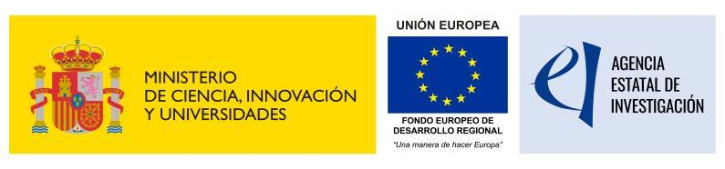

.. _insertion:

============================
INSERTION
============================

Aerostack2 was partially developed during the INSERTION project (Inspection and maiNtenance in harSh EnviRonments by mulTI-robot cooperatiON), funded by the Spanish Agencia Estatal de Investigación (AEI/MICIU) under the 2021 "Proyectos de Generación de Conocimiento" call, and co-financed by the European Union.

The main goal of INSERTION is to advance the state of the art of the technologies required for the safe operation of teams of robots, comprising UAVs, UGVs and USVs, for Inspection and Maintenance (I&M) in harsh environments. The project develops new techniques for localization in low-visibility scenarios; navigation in complex environments with clutter; cooperation between UAVs, UGVs and USVs; and control strategies for safe operation and dynamic positioning of UAVs and USVs in harsh environments.

Inspection and Maintenance robotics is a growing application area with great potential social and economical impact, particularly when considering hazardous and dangerous environments. Bringing robot automation to these environments reduces the risks associated with human operations and improves working conditions. Target applications include sewers, off-shore Oil&Gas platforms, wind-turbines, gas/power transportation tunnels, mines, industrial storage tanks, and polluted water bodies.

The project addresses three global objectives:

- **GO1 - Reliable perception, localization and mapping in harsh environments:** Development of robust localization and perception methods able to work in low-visibility conditions such as fog, rain or darkness, exploiting multi-sensor approaches with visual cameras, LiDAR and RADAR.

- **GO2 - Robust navigation and precise robot control in complex environments:** Development of control strategies for commanding UAVs and USVs in complex scenarios involving wind gusts, water currents and strong perturbations, building a safe autonomous robot navigation system in 3D clutter environments.

- **GO3 - Tight and loose multi-robot cooperation strategies for complex scenarios:** Development of multi-robot cooperation strategies integrating different types of agents (UAVs, UGVs and USVs), including swarm-based loose cooperation and tethered tight cooperation.

The project is structured as a coordinated project with three sub-projects:

- **Sub-project 1 — Robust Localization, Mapping and Planning in Harsh Environments**, led by the `Service Robotics Laboratory (SRL) <https://www.upo.es/robot/en/>`_ of the Universidad Pablo de Olavide (UPO), focusing on heterogeneous robot localization, mapping, planning, and multi-robot coordination.

- **Sub-project 2 — UAV Perception, Control and Operation in Harsh Environments**, led by the `Computer Vision and Aerial Robotics (CVAR) <https://cvar.fi.upm.es/>`_ group of the Universidad Politécnica de Madrid (UPM), bringing expertise in UAV autonomy and teams of UAVs in GPS-denied areas.

- **Sub-project 3 — Cooperation of USVs and UAVs for Inspection Applications in Dynamic Environments**, led by the `Systems engIneering, Control, Automation and Robotics (ISCAR) <https://www.iscar.es/>`_ group of the Universidad Complutense de Madrid (UCM), contributing expertise in USVs, cooperation of heterogeneous robots, and applications in aquatic environments.

The INSERTION project builds on the results of the former coordinated project COMCISE (COMplex Coordinated Inspection and Security missions by UAVs in cooperation with UGV, RTI2018-100847-C11 and C12), extending its scope to USVs, harsher environments with reduced visibility, and more complex multi-robot cooperation scenarios.

