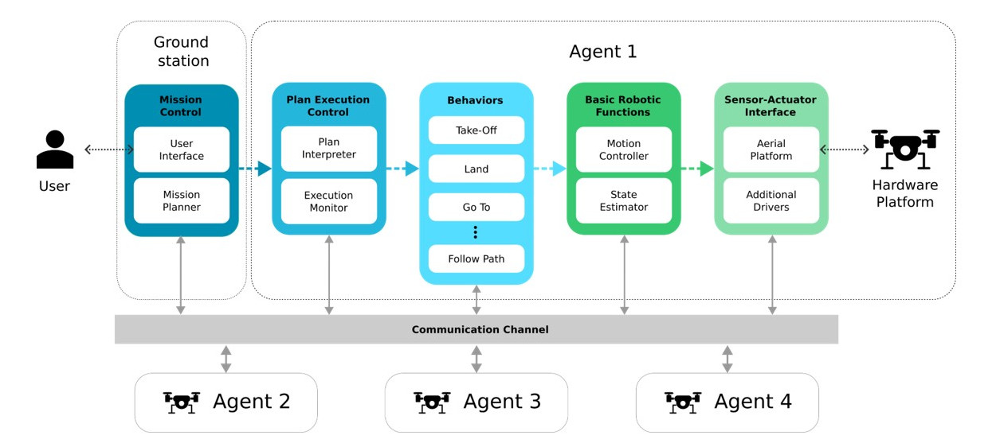

.. _as2_docs:

======================================
Welcome to Aerostack2's documentation!
======================================

.. raw:: html

    

        <iframe src="https://www.youtube.com/embed/IvItNtSB-QE" frameborder="0" allowfullscreen style="position: absolute; top: 0; left: 0; width: 100%; height: 100%;"></iframe>
    

.. _as2_docs_overview:

--------
Overview
--------

Aerostack2 is an open source software framework that helps developers design and build the control architecture of aerial robotic systems, integrating multiple heterogeneous computational solutions (e.g., computer vision algorithms, motion controllers, self-localization and mapping methods, motion planning algorithms, etc.), built for ROS 2 `Humble <https://docs.ros.org/en/humble/index.html>`_ and ROS 2 `Galactic <https://docs.ros.org/en/galactic/index.html>`_.

Aerostack2 is useful for building autonomous aerial systems in complex and dynamic environments and it is also a useful research tool for aerial robotics to test new algorithms and architectures.

It was created to be available for communities of researchers and developers and it is currently an active open-source project with periodic software releases. 

Aerostack2 is versatile for building different system configurations with various degrees of autonomy. It's most important features are:

* From teleoperation to autonomous flight. Aerostack2 can be used for teleoperation flights (with manual control) but it can also be used for building autonomous robot systems to perform aerial missions without operator assistance.

* Single robots or multi-robot systems. Aerostack2 can be used to fly a swarm of heterogeneous drones to perform multi-aerial-robot missions. It has been validated to operate with severals drones simultaneously, both in indoor and outdoor environments.

* Flexible for different applications. Aerostack2 can be used by system designers to develop their own systems in a wide range of applications. Aerostack2 provides languages and graphical tools to configure specific aerial missions.

* Hardware independent. Aerostack2 runs on conventional laptops and it has also run on onboard computers like Nvidia Jetson NX. Aerostack2 has been used in different aerial platforms, including, but not limited to: DJI platforms (Matrice 210RTKv2, Matrice 300, Ryze Tello), Pixhawk autopilots and Crazyflie drones. The framework can operate in simulation and in a real environment in a similar way, what simplifies the Sim2Real development.

* Complete modularity, allowing elements to be changed or interchanged without affecting the rest of the system. Plugin-based architecture allows to use different implementations for every tasks.

* Project-oriented, allowing to install and use only the necessary packages and configurations for the application to be developed. 

   Aerostack2 architecture overview

--------
Credits
--------

If you use the code in the academic context, please cite\:

* \M. Fernandez-Cortizas, M. Molina, P. Arias-Perez, R. Perez-Segui, D. Perez-Saura, and P. Campoy, 2023,  `"Aerostack2: A software framework for developing multi-robot aerial systems" <https://arxiv.org/abs/2303.18237>`_ , ArXiv DOI 2303.18237.

.. .. _as2_docs_index:

.. -----------------
.. Table of Contents
.. -----------------

.. toctree::
   :hidden:

   _00_getting_started/index.rst
   _01_aerostack2_concepts/index.rst
   _02_examples/index.rst
   _03_aerial_platforms/index.rst
   _04_robot_behaviors/index.rst
   _05_as2_plugins/index.rst
   _06_user_interfaces/index.rst
   _07_python_api/index.rst
   _08_ros2_common_interfaces/index.rst
   _09_development/index.rst
   _10_roadmaps/index.rst
   _11_license/index.rst
   _12_citations/index.rst
   _13_about_and_contact/index.rst
